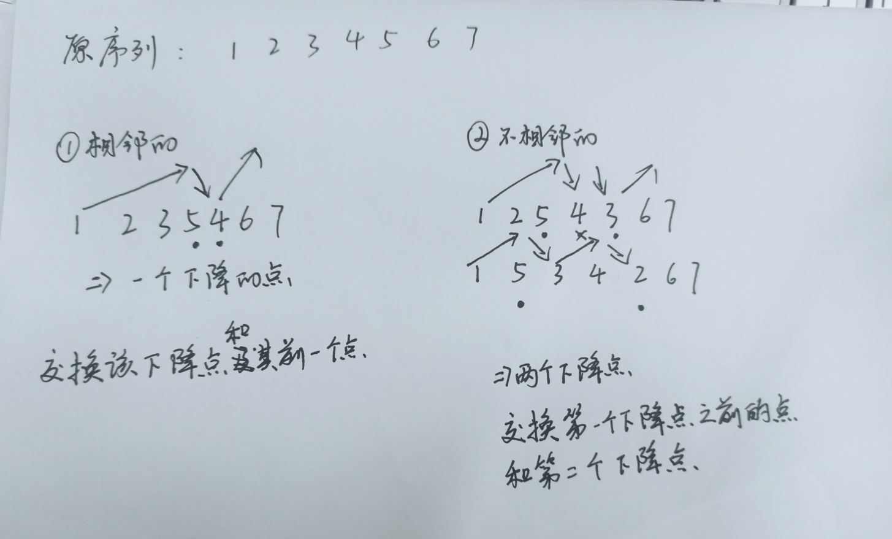

# 树

[toc]

---

##树的基本概念

*   
*   根节点
    *   没有父节点的节点；图中的A节点
    *   且树种的每个节点最多只能有一个父节点
*   叶子节点
    *   没有孩子节点的节点（度为零的节点）；图中的BCHIPQKLMN
*   树的深度(高度)
    *   即树的层数；图中的数深度为4
*   树的度
    *   一个节点的孩子节点的个数叫做节点的度；图中E节点的度为2，F节点的3
    *   树的度就是所有节点度最大的度；图中的树的度即为3
*   孩子节点、父节点

*   子树


##二叉树

*   二叉树：度不超过2的树
*   每个节点最多有两个节点；分别为左孩子、右孩子节点

## 满二叉树

*   如果一个二叉树每一层的节点个数都是最大值

## 完全二叉树

*   叶子节点只出现在最后一层；且最后一层的所有叶子节点集中在左侧
*   完全二叉树的高度是$O(logN)$

## 二叉排序树

*   一个数中的所有父节点 都能区分开左右两个子树
    *   比如在父节点的左侧都是小于等于父节点的 父节点的右树都是大有父节点的

## 二叉树的性质

*   i的父节点
    *   $(i-1)//2$
*   i的左节点
    *   $i*2+1$
*   i的右节点
    *   $i*2+2$
*   第i层上的最大子节点个数为
    *   $2^(i-1)$

*   深度为i的二叉树的最大节点中和为
    *   $2^i-1$

*   一个有n个节点的完全二叉树；它的深度为$ int(log_2n)+1$想下去整再+1
*   二叉树中度数为0的节点为N0，度数为2的节点为N2，则N0=N2+2

## 树的实现

*   代码

    *   ```python
        class Node():
            def __init__(self,item):
                self.item = item
                self.lnode = None
                self.rnode = None
        class biTree():
            def __init__(self):
                self.root = None
            
            def add(self, item):
                tempNode = Node(item)
                if self.root == None:   # 空树
                    self.root = tempNode
                    return
                tempQueue = deque()
                tempQueue.append(self.root)
                while True:
                    temp = tempQueue.popleft()
                    if temp.lnode == None:
                        temp.lnode = tempNode
                        break
                    elif temp.rnode == None:
                        temp.rnode = tempNode
                        break
                    else:
                        tempQueue.append(temp.lnode)
                        tempQueue.append(temp.rnode)
            
        	#四种遍历 											↓
        
            def size(self):
                if self.root == None:
                    return 0
                count = 0
                tempQueue = deque()
                tempQueue.append(self.root)
                while tempQueue.__len__() > 0:
                    temp = tempQueue.popleft()
                    count += 1
                    if temp.lnode != None:
                        tempQueue.append(temp.lnode)
                    if temp.rnode != None:
                        tempQueue.append(temp.rnode)
                return count
        ```


## 树的遍历

​	

*   层次遍历

    *   队列; 广度优先；前中后序都是栈; 后序遍历

*   前序遍历(先序遍历)

    *   父节点在前

*   中序遍历

    *   父节点在中

*   后续遍历

    *   父节点在后

*   ```python
    # 层次遍历
    def breadth_travel(self):
        if self.root == None:
            print("树为空！！！")
            return 0
        tempQueue = deque()
        tempQueue.append(self.root)
        while tempQueue.__len__() > 0:
            temp = tempQueue.popleft()
            print(temp.item, end = '')
            if temp.lnode != None:
                tempQueue.append(temp.lnode)
            if temp.rnode != None:
                tempQueue.append(temp.rnode)
    
    # inorder 中序遍历
    def inorder_travel(self):
        if self.root == None:
            print("树为空！！！")
            return
        self.inorderFunc(self.root)
    def inorderFunc(self, node):
        if node == None:
            return
        self.inorderFunc(node.lnode)
        print(node.item, end = '')
        self.inorderFunc(node.rnode)
        
    # preorder 前序遍历
    def preorder_travel(self):
        if self.root == None:
            print("树为空！！！")
            return
        self.preorderFunc(self.root)
    
    def preorderFunc(self, node):
        if node == None:
            return
        print(node.item, end = '')
        self.preorderFunc(node.lnode)
        self.preorderFunc(node.rnode)
    
    
    
    # postorder 后序遍历
    def postorder_travel(self):
        if self.root == None:
            print("树为空！！！")
            return
        self.postorderFunc(self.root)
    def postorderFunc(self, node):
        if node == None:
            return
        self.postorderFunc(node.lnode)
        self.postorderFunc(node.rnode)
        print(node.item, end = '')
    
    ```


---

## 哈夫曼树

*   哈夫曼树又称最优二叉树

*   它是根据所给数据中各项数据出现的频率所构建的的一棵二叉树

*   哈夫曼编码的特点

    *   可变长编码
    *   编码间无二义性(两两互补为前缀)

*   构建方法

    *   假设有n个权值，则构造出的哈夫曼树有n个叶子结点。 n个权值分别设为 w1、w2、…、wn，则哈夫曼树的构造规则为：

        (1) 将w1、w2、…，wn看成是有n 棵树的森林(每棵树仅有一个结点)；

        (2) 在森林中选出两个根结点的权值最小的树合并，作为一棵新树的左、右子树，且新树的根结点权值为其左、右子树根结点权值之和；

        (3)从森林中删除选取的两棵树，并将新树加入森林；

        (4)重复(2)、(3)步，直到森林中只剩一棵树为止，该树即为所求得的哈夫曼树。

*   实现代码

    *   ```python
        from collections import deque
        
        # 比较器
        def cmp(a, b):
            if a.data < b.data:
                return -1
            elif a.data > b.data:
                return 1
            return 0
        
        # 快速排序
        def quickSort(tList):
            nLen = len(tList)
            if nLen <= 1:
                return tList
            mid = tList[0]
            smaller = -1 
            bigger = nLen
            i = 1
            while i < bigger:
                if cmp(tList[i], tList[smaller+1]) == -1:
                    tList[i], tList[smaller+1] = tList[smaller+1], tList[i]
                    smaller += 1
                elif cmp(tList[i], tList[bigger-1]) == 1:
                    tList[i], tList[bigger-1] = tList[bigger-1], tList[i]
                    bigger -= 1
                    i -= 1
                i += 1
            if smaller == -1:
                sList = []
            else:
                sList = quickSort(tList[:smaller+1])
            if bigger == nLen:
                bList = []
            else:
                bList = quickSort(tList[bigger:])
        
            return sList + tList[smaller+1:bigger] + bList
        
        # 节点类
        class Node():
            def __init__(self, data):
                self.data = data
                self.lNode = None
                self.rNode = None
                self.paNode = None  # 父节点
        
        # 构建树
        class hTree():
        
            def __init__(self, chList):
        
        
               # 生成哈夫曼树
               # 1.将列表中的值都转为节点类
                nodeList = list()
                for i in chList:
                    tempNode = Node(i)
                    nodeList.append(tempNode)
                
                while len(nodeList) > 1:
                    # 排序-----比较器
                    nodeList = quickSort(nodeList)
                    # 组合两个子树
                    lTree =  nodeList.pop(0)
                    rTree =  nodeList.pop(0)
                    fTree = Node(rTree.data + lTree.data)
                    fTree.lNode = lTree
                    fTree.rNode = rTree
                    rTree.paNode = fTree
                    lTree.paNode = fTree
                    # 将新树加入    
                    nodeList.append(fTree)
                # 
                self.root = nodeList[0]
                nodeList.pop()
        
            # 对字符进行编码
            def find(self, key):
                tempQueue = deque()
                tempQueue.append(self.root)
                
                while True:
                    tempNode = tempQueue.popleft()
                    if tempNode.lNode == None and tempNode.rNode == None and tempNode.data == key:
                        keyNode =  tempNode
                        break
                    if tempNode.lNode != None:
                        tempQueue.append(tempNode.lNode)
                    if tempNode.rNode != None:
                        tempQueue.append(tempNode.rNode)
                # 找到指定字符的位置
                # 回溯出路径
                result = ''
                while keyNode.paNode != None:
                    if keyNode.paNode.lNode == keyNode:
                        result += '0'
                        keyNode = keyNode.paNode
                        continue
                    if keyNode.paNode.rNode == keyNode:
                        result += '1'
                        keyNode = keyNode.paNode
        
                result = result[::-1]
                return result        
                
            # 解码
            def decode(self, inStr):
                outStr = ''
                tempNode = self.root
                for i in inStr:
                    if tempNode.lNode == None and tempNode.rNode == None:
                        for j in chDict:
                            if chDict[j][0] == tempNode.data:
                                outStr += j
                                tempNode = self.root
                    if i == '0':
                        tempNode = tempNode.lNode
                    else:
                        tempNode = tempNode.rNode
                return outStr
        
        if __name__ == '__main__':
            # 1.打卡文件 并统计词频字典
            chDict = dict()
            with open(r"F:\\Course.txt", 'r') as rstream:
                tempStr = rstream.read()
            
            for i in tempStr:
                if i not in chDict:
                    chDict[i] = 1
                else:
                    chDict[i] += 1
            # 测试输出
            # for i in chDict:
            #     print(f"{i} :  {chDict[i]}")
            
            # 2.生成哈夫曼树
            myTree = hTree(chDict.values())
        
            # 3.根据哈夫曼树更新字典
            for i in chDict:
                temp = myTree.find(chDict[i])
                chDict[i] = [chDict[i], temp]
                # print(i,':',chDict[i])
            
            # 4.创建压缩
            with open("F:\\Huff.txt", 'w') as wstream:
                for i in tempStr:
                    temp = chDict[i][1]
                    wstream.write(temp)
            # 5.ascii码源文件
            with open("F:\\Ascii.txt", 'w') as wstream:
                for i in tempStr:
                    temp = str(bin(ord(i)))[2:]
                    wstream.write(temp)
            
            # 6.哈夫曼解码
            with open("F:\\Huff.txt", 'r') as rstream:
                temp = rstream.read()
                temp = myTree.decode(temp)
                with open("F:\\Huff_decode.txt", 'w') as wstream:
                    wstream.write(temp)
            
        
            # 7.统计哈夫曼编码和Ascii码编码的长度
            with open("F:\\Huff.txt", 'r') as rstream:
                temp = rstream.read()
                count = 0
                for i in temp:
                    count += 1 
            print(f"哈夫曼编码后二进制个数为:{count:,}")
            with open("F:\\Ascii.txt", 'r') as rstream:
                temp = rstream.read()
                count = 0
                for i in temp:
                    count += 1 
            print(f"Ascii码二进制个数为:{count:,}")
        ```

---

## 前缀树Trie

*   

*   前缀树的实现
    *   ```python
        # 实现Node
        class Node():
            def __init__(self):
                self.Pass = 0
                self.End = 0
                self.Nexts = dict()
        
        # 实现Tree
        class Trie():
            def __init__(self):
                self.root = Node()
            
            # 增
            def addStr(self, tStr):
                tempNode = self.root
                tempNode.Pass += 1
        
                if len(tStr) == 0:# 空串
                    tempNode.End += 1
                    return
                
                for i in range(len(tStr)):
                    tempChar = tStr[i]
                    if tempNode.Nexts.get(tempChar) ==  None:   # 是否tempChar对应的子节点
                        tempNode.Nexts[tempChar] = Node()
                        tempNode = tempNode.Nexts[tempChar]
                    else:
                        tempNode = tempNode.Nexts[tempChar]
                    tempNode.Pass += 1
        
                tempNode.End += 1
        
            # 删
            def delStr(self, tStr):
                if not self.exist(tStr):    # 字符串不存在
                    return None
                
                tempNode = self.root
                tempNode.Pass -= 1
                
                for i in range(len(tStr)):
                    tChar = tStr[i]
                    if tempNode.Nexts[tChar].Pass - 1 == 0:
                        tempNode.Pass -= 1
                        tempNode.Nexts.pop(tChar)
                        return True
                    else:
                        tempNode = tempNode.Nexts[tChar]
                        tempNode.Pass -= 1
                tempNode.End -= 1  
        
            # 查询一个字符串是否在树上
            def exist(self, tStr):
                tempNode = self.root
                
                for i in range(len(tStr)):
                    tChar = tStr[i]
                    if tempNode.Nexts.get(tChar) == None:   # 没有以字符串tStr开头
                        return False
                    else:
                        tempNode = tempNode.Nexts[tChar]
        
                if tempNode.End > 0:
                    return True
                return False
        
            # 查询有多少个字符串是以str为前缀的
            def strCheck(self, tStr):
                tempNode = self.root
                
                for i in range(len(tStr)):
                    tChar = tStr[i]
                    if tempNode.Nexts.get(tChar) == None:   # 没有以字符串tStr开头
                        return None
                    else:
                        tempNode = tempNode.Nexts[tChar]  
                return tempNode.Pass
        
            # 查询有多少个字符串空串
            def getNull(self):
                return self.root.End
        
            # 返回前缀树上字符串的个数
            def getNum(self):
                return self.root.Pass
        
        if __name__ == '__main__':
            myTrie = Trie()
            myTrie.addStr("apple")
            myTrie.addStr("CDC")
            myTrie.addStr("app")
            myTrie.addStr("aBp")
            myTrie.addStr("CSC")
            myTrie.addStr("awm")
            myTrie.addStr("apend")
            myTrie.addStr("CCTV")
            myTrie.addStr("我是靓仔")
            myTrie.addStr("ap伤害")
            myTrie.addStr("ap")
            myTrie.addStr("ap伤害")
            myTrie.addStr("")
            myTrie.addStr("我是帅哥")
            myTrie.addStr("你是靓仔")
            myTrie.addStr("")
        
            # tStr = 'ap'
            # count = myTrie.strCheck(tStr)
            # if count == None:
            #     print(f"没有以{tStr}开头的字符串！！！")
            # else:
            #     print(f"有{count}个以{tStr}开头的字符串")
        
            # 查询存在
            # print(myTrie.exist('我是'))
        
            # 删除
            print(myTrie.getNum())
            myTrie.delStr("")
            print(myTrie.getNum())
        ```


---

## 二叉搜索树

*   二叉搜索树BST Binary Search Tree  又称 二叉排序树 BST Binary Sort Tree
*   整个数的所有根节点都大于它的左子树，大于它的右子树
*   二叉搜索树的中序遍历是 按比较顺序输出每个节点

*   增

    *   递归方法
        *   如果当前树的左右子节点都非空；则判断插入点应该在该树的左子树还是右子树；并调用自身减小树的规模；
        *   基类即为找到了叶子节点；就是出入节点的正确位置，插入该点
    *   非递归方法
        *   从根节点开始
        *   依次向下找到插入元素应该所处的正确叶子节点位置

*   删

    *   分类讨论删除的节点的孩子情况

        *   无左右子树

            *   那么该节点即为叶子节点，让它的父节点指向空节点即可

        *   只有一个子树

            *   该树的子树代替自己现在的位置
            *   子树的父节点设为当前节点的父节点；line:96
            *   判断当前节点是父节点的左还是右子树；并用自己的子树代替;line:97
            *   注意讨论删除的是根节点的情况

        *   有左右子树

            *   可以选择左子树上的最大值节点；也可以选择右子树上的最小值节点；可以从中序遍历有序的角度思考这个节点的选取；即必须是离被删除节点最近的一个值

            *   被选择的节点将它的值保存下来；递归调用自己删除该节点；以为被选择的节点一定是子树小于2的，所以能成功删除
            *   将保存下来的值赋值给目标删除节点

*   实现代码

    *   ```python
        # 二叉搜索树的实现
        
        # 定义Node类
        class Node():
            def __init__(self, item):
                self.item = item
                self.lTree = None
                self.rTree = None
                self.pNode = None
        
        # 定义BST类
        class BST():
            # 初始化
            def __init__(self):
                self.root = None
            
            # 中序遍历
            def inOrder(self, node):
                if node == None:
                    return
                
                self.inOrder(node.lTree)
                print(node.item)
                self.inOrder(node.rTree)
                
            # 增
            def add1(self, item):
                # 非递归调用
                if self.root == None:
                    self.root = Node(item)
                    return
                tempNode = self.root
                while tempNode != None:
                    if item < tempNode.item:
                        if tempNode.lTree == None:
                            tempNode.lTree = Node(item)
                            tempNode.lTree.pNode = tempNode
                            return
                        else:
                            tempNode = tempNode.lTree
                    elif item > tempNode.item:
                        if tempNode.rTree == None:
                            tempNode.rTree = Node(item)
                            tempNode.rTree.pNode = tempNode
                            return
                        else:
                            tempNode = tempNode.rTree
                    else:
                        print("The num has been pushed!")
        
            def add(self, node, item):# 递归调用
                if self.root == None:
                    tempNode = Node(item)
                    self.root = tempNode
                    return
        
                if node == None:
                    node = Node(item)
                    return node
                elif item < node.item:
                    r = self.add(node.lTree, item)
                    if r != None:
                        r.pNode = node
                        node.lTree = r
                elif item > node.item:
                    r = self.add(node.rTree, item)
                    if r != None:
                        r.pNode = node
                        node.rTree = r
                else:
                    print("The number has been pushed!")
                return None
        
            # 删
            # 分类讨论删除节点的孩子情况
            # 一个孩子
            # 两个孩子
            # 没有孩子
            def Del(self, item):
                r = self.search1(item)
                # 判断数中是否有该数
                if r == None:
                    return None
                
                if r.lTree == None and r.rTree == None:
                    if r.item < r.pNode.item:   # 删除节点为父节点的左子树
                        r.pNode.lTree = None
                    else:
                        r.pNode.rTree = None
                elif r.lTree == None and r.rTree != None:   # 只有右子树
                    if r.pNode == None: # 删除的是根节点
                        self.root = r.rTree
                        r.rTree.pNode = None
                        return item
                    r.rTree.pNode = r.pNode
                    if r.item < r.pNode.item:
                        r.pNode.lTree = r.rTree
                    else:
                        r.pNode.rTree = r.rTree
                elif r.lTree != None and r.rTree == None:   # 只有左子树
                    if r.pNode == None: # 删除的是根节点
                        self.root = r.lTree
                        r.lTree.pNode = None
                        return item
                    r.lTree.pNode = r.pNode
                    if r.item < r.pNode.item:
                        r.pNode.lTree = r.lTree
                    else:
                        r.pNode.rTree = r.lTree
                else:   # 拥有左右子树
                    rMax = self.getmin(r.rTree)
                    temp = rMax.item
                    self.Del(temp)
                    r.item = temp
                     
            # 查
            def search(self, node ,key):
                # 递归
                if node == None:
                    return None
                
                if key < node.item:
                    return self.search(node.lTree, key)
                elif key > node.item:
                    return self.search(node.rTree, key)
                else:
                    return key
            
            def search1(self, key):
                # 非递归
                tempNode = self.root
                while tempNode != None:
                    if key < tempNode.item:
                        tempNode  = tempNode.lTree
                    elif key > tempNode.item:
                        tempNode  = tempNode.rTree
                    else:
                        return tempNode
                return None
            # 返回一棵树最大值和最小值节点
            def getMax(self, node):
                if self.root == None:
                    return None
                tempNode = node
                while tempNode.rTree != None:
                    tempNode = tempNode.rTree
                return tempNode
        
            def getmin(self, node):
                if self.root == None:
                    return None
                tempNode = node
                while tempNode.lTree != None:
                    tempNode = tempNode.lTree
                return tempNode
        
        if __name__ == '__main__':
            myBST = BST()
            myBST.add1(100)
            myBST.add1(75)
            myBST.add1(110)
            myBST.add1(50)
            myBST.add1(80)
            myBST.add1(120)
            myBST.add1(115)
            myBST.add1(130)
            myBST.add1(125)
            myBST.add1(126)
            myBST.add1(123)
        
            # myBST.add(myBST.root,100)
            # myBST.add(myBST.root,75)
            # myBST.add(myBST.root,110)
            # myBST.add(myBST.root,80)
            # myBST.add(myBST.root,50)
        
        
            # if myBST.search1(100):
            #     print("数中有该数字")
            # else:
            #     print("数中不存在这个数字")
        
            # print("---")
            # print(myBST.getMax(myBST.root).item)
            # print(myBST.getmin(myBST.root).item)
        
            print("-"*30)
            myBST.inOrder(myBST.root)
        
            myBST.Del(100)
        
            print("-"*30)
            myBST.inOrder(myBST.root)
        ```

### 二叉排序树的问题

*   请写出递归算法，从小到大输出二叉排序树中所有数据值≥x的结点的数据。要求先找到第一个满足条件的结点后，再依次输出其他满足条件的结点。

    *   实现代码

        *   ```python
            # 求一颗搜索二叉树的深度
            
            # Node类
            class Node():
                def __init__(self, item):
                    self.item = item
                    self.lTree = None
                    self.rTree = None
            # BST类
            class BST():
                def __init__(self):
                    self.root = None
                def add(self, item):
                    if self.root == None:
                        tempNode = Node(item)
                        self.root = tempNode
                        return
                    tempNode = self.root
                    while tempNode != None:
                        if item < tempNode.item:
                            if tempNode.lTree == None:
                                tempNode.lTree = Node(item)
                                return
                            tempNode = tempNode.lTree
                        elif item > tempNode.item:
                            if tempNode.rTree == None:
                                tempNode.rTree = Node(item)
                                return
                            tempNode = tempNode.rTree
                        else:
                            print("The number has existed")
                            return None
                def inOrder(self, node):
                    if node == None:
                        return None
                    if node.lTree != None:
                        self.inOrder(node.lTree)
                    print(node.item)
                    if node.rTree != None:
                        self.inOrder(node.rTree)
                def func(self, key):
                    if self.root == None:
                        return 0
                    
            if __name__ == '__main__':
                myBST = BST()
                myBST.add(100)
                myBST.add(75)
                myBST.add(110)
                myBST.add(50)
                myBST.add(80)
                myBST.add(120)
                myBST.add(115)
                myBST.add(130)
                myBST.add(125)
                myBST.add(126)
                myBST.add(123)
            
                deep = myBST.func()
                print(f"这颗二叉树的深度为{deep}")
            ```

*   输出一颗给定树的深度

    *   利用后序遍历求出根节点的最大高度；根节点的高度就是树的最大深度；注意区分高度和深度的意义

    *   ```python
        def func(self, node):
            global lDeep, rDeep
            if node == None:
                return 0   
            lDeep = self.func(node.lTree)
            rDeep = self.func(node.rTree)
            
            return max(rDeep, lDeep)+1
        ```

*   左右子树翻转

    *   ```python
        def func(self, node):
            if node == None:
                return
            node.lTree, node.rTree = node.rTree, node.lTree
            self.func(node.lTree)
            self.func(node.rTree)
        ```

*   输出一棵树的最大宽度

    *   节点最多的一层 的节点个数

    *   解题思路

        *   

    *   实现代码

        *   ```python
            class BST():
                def __init__(self):
                    self.root = None
            ...
                def func(self, node):
                    if node == None:
                        return 0
                    
                    tQueue = []
                    ln = 1
                    tQueue.append([node, ln])# 记录没个节点已经它的层数 到一个列表中
                    i = 0
                    
                    while True:
                        if tQueue[i][0].lTree != None:
                            tQueue.append([tQueue[i][0].lTree, tQueue[i][1] + 1])
                        if tQueue[i][0].rTree != None:
                            tQueue.append([tQueue[i][0].rTree, tQueue[i][1] + 1])
                        i += 1
                        if i == len(tQueue):# 当遍历完了整个队列就退出
                            break
                    
                    # 扫描列表 找出节点个数最多的一层并返回个数
                    r = dict()
                    for i in tQueue:
                        if i[1] not in r:
                            r[i[1]] = 1
                        else:
                            r[i[1]] += 1
                    max = 0
                    for i in r:
                        if r[i] > max:
                            max = r[i]
                    return max
            if __name__ == '__main__':
                myBST = BST()
                myBST.add(100)
                myBST.add(75)
                myBST.add(110)
                myBST.add(50)
                myBST.add(80)
                myBST.add(120)
                myBST.add(115)
                myBST.add(105)
                myBST.add(130)
                myBST.add(125)
                myBST.add(126)
                myBST.add(123)
            
                width = myBST.func(myBST.root)
                print(f"这颗二叉树的深度为{width}")
                
            ```


## Morris遍历

### Morris遍历的思想

-   在普通的递归遍历中每个节点都会被遍历三遍

-   1.当执行到该节点是

-   2.执行完左子树回到当前节点时

-   3.执行玩右子树回到当前节点时

-   因为在递归调用过程中，系统会自动开辟栈来保存状态信息，所以不需要关心进入当前节点是第几次

-   ---

-   Morris遍历是建立一种机制，让没有左子树的节点值遍历一次，有左子树的节点遍历两次

-   利用巧妙的临时修改数的结构，来判断进入当前节点的次数

### Morris遍历的大流程

-   遍历到一个节点cur时，判断当前节点是否存在左子树，如不存在，直接跳到右节点；
-   如果存在左子树，那么取得cur左子树上打的最右节点
-   最右节点:一个树上一直往右，直到终止；终止条件：1.当前节点的右子树为空2.当前节点的右子树为cur
-   判断最右节点的状态;1.最右节点的右节点为空：将最右节点的有指针指向cur，cur = cur.left;2.最右节点的右节点为cur, 说当前节点第二次遍历到，将最右节点的值置为空，cur = cur.right
-   cur为空时整棵树遍历完成
-   时间复杂度O(N) 空间复杂度O(1); 递归遍历的时间复杂度为O(N),空间浮渣度为树的最大深度


### Morris前中后续遍历

-   前序遍历: 在每个节点第一次被遍历到时输出当前节点的值，第二次跳到当前节点不做操作

-   实现代码

    -   ```python
        res = []
        
        cur = root
        # Morris遍历
        while cur:
            if cur.left != None:
                mostRight = cur.left
                while mostRight.right != None and mostRight.right != cur:
                    mostRight = mostRight.right
                if mostRight.right == None:
                    # 第一次遍历到当前节点cur
                    res.append(cur.val)
                    mostRight.right = cur
                    cur = cur.left
                    continue
                else:
                    # mostRight == cur ; 第二次来到当前节点
                    mostRight.right = None
                    cur = cur.right
                    continue
                
            res.append(cur.val)
            cur = cur.right
        
        return res
        ```

-   中序遍历：在没有左子树的节点直接输出，有左子树的节点在第二次遍历到当前节点时遍历

-   实现代码

    -   ```python
        res = []
        
        cur = root
        # Morris遍历
        while cur:
            if cur.left != None:
                mostRight = cur.left
                while mostRight.right != None and mostRight.right != cur:
                    mostRight = mostRight.right
                if mostRight.right == None:
                    # 第一次遍历到当前节点cur
                    mostRight.right = cur
                    cur = cur.left
                    continue
                else:
                    # mostRight == cur ; 第二次来到当前节点
                    mostRight.right = None
                
            res.append(cur.val)
            cur = cur.right
        
        return res
        ```

-   后续遍历Morris遍历一样可以实现，且时间复杂度和空间复杂化度指标不变；但是流程比较复杂，建议直接递归


---


## leetCode95 不同的二叉搜索树 II

-   问题描述
    -   [问题地址](https://leetcode.cn/problems/unique-binary-search-trees-ii/)
-   解题思路
    -   传入当前树中节点中的上下界值，如果下界值大于上界值证明当前数为空；
    -   在[left, right]区间中依次选取当前节点的值，去生成左右子树的集合`l:17-19`
    -   在对左右子树进行排列组合生成当前规模下的所有树`l:21-27`
    -   返回包含当前层所有树根节点的数组

-   实现代码

    -   ```python
        # Definition for a binary tree node.
        # class TreeNode:
        #     def __init__(self, val=0, left=None, right=None):
        #         self.val = val
        #         self.left = left
        #         self.right = right
        class Solution:
            def generateTrees(self, n: int) -> List[Optional[TreeNode]]:
                res = []
        
                def createTree(left, right):
                    if left > right:
                        # 因为在上一层会遍历当前层的返回值，所以None需要括起来让返回值可迭代
                        return [None]
                    
                    allTrees = []
                    for now in range(left, right + 1):
                        lTrees = createTree(left, now - 1)
                        rTrees = createTree(now + 1, right)
        
                        for pickLtree in lTrees:
                            for pickRtree in rTrees:
                                # 每棵树的新节点必须在这里生成
                                # puchline
                                nowRoot = TreeNode(now)
                                nowRoot.left = pickLtree
                                nowRoot.right = pickRtree
                                allTrees.append(nowRoot)
                    return allTrees
        
                res = createTree(1, n)
                return res
        ```

​	


## leetCode98 验证二叉搜索树

-   问题描述

    -   [问题地址](https://leetcode.cn/problems/validate-binary-search-tree/)

-   **易错点：一个节点不能值比较当前节点和自己左右子树根节点的大小关系，而是要和左右子树整体节点进行验证**

-   解题思路_中序遍历

    -   验证搜索二叉树的特性：中序遍历的序列一定是升序
    -   中序遍历输出判断是否是升序
    -   **如果要用Morris遍历，注意不能在检测到不合法点直接返回，因为树被临时修改过，所以必须等遍历行为结束后在返回**

-   实现代码

    -   ```python
        # Definition for a binary tree node.
        # class TreeNode:
        #     def __init__(self, val=0, left=None, right=None):
        #         self.val = val
        #         self.left = left
        #         self.right = right
        class Solution:
            def isValidBST(self, root: Optional[TreeNode]) -> bool:
                
                def DFS(node):
                    if node == None:
                        return [None]
                    return DFS(node.left) + [node.val] + DFS(node.right) 
        
                res = DFS(root)
                pre = None
                for n in res:
                    if n != None:
                        if pre == None:
                            pre = n
                        else:
                            if pre < n:
                                pre = n
                            else:
                                return False
        
                return True
        ```

-   解题思路_判断当前节点值

    -   判断当前节点的值是否合法；一个合法的搜索二叉树，一个节点的左子树的最大值必须小于当期节点的值，右子树的最小值必须大于当前节点的值；所以在递归一个点的左右树时利用当前节点的值去限制子树的取值范围
    -   如果一个节点超出了父节点给他的限制范围，那么就不是搜索二叉树；在第一次进入根节点时无限制，设为系统最大和系统最小值

-   实现代码_判断当前节点值

    -   ```python
        # Definition for a binary tree node.
        # class TreeNode:
        #     def __init__(self, val=0, left=None, right=None):
        #         self.val = val
        #         self.left = left
        #         self.right = right
        class Solution:
            def isValidBST(self, root: Optional[TreeNode]) -> bool:
                import sys
                def DFS(node, MIN, MAX):
                    if node == None:
                        return True
        
                    if DFS(node.left, MIN, node.val) and DFS(node.right, node.val, MAX) and node.val < MAX and node.val > MIN:
                        return True
                    return False
        
        
                return DFS(root, -sys.maxsize, sys.maxsize)
        ```


## leetCode99 恢复二叉搜索树

-   问题描述

    -   [问题地址](https://leetcode.cn/problems/recover-binary-search-tree/)

-   解题思路

    -    合法的搜索二叉树的中序遍历序列是升序的
    -   如果出现了两个点交换那么可能出现一个或者两个单调性下降的点
    -   
    -   如果要使用Morris遍历，不能再遍历中途跳出遍历，必须要遍历完才能下一步处理

-   实现代码

    -   ```python
        # Definition for a binary tree node.
        # class TreeNode:
        #     def __init__(self, val=0, left=None, right=None):
        #         self.val = val
        #         self.left = left
        #         self.right = right
        class Solution:
            def recoverTree(self, root: Optional[TreeNode]) -> None:
                """
                Do not return anything, modify root in-place instead.
                """
                p1 = p2 = pre = None
                cur = root
        
                while cur:
                    if cur.left != None:
                        mostRight = cur.left
                        while mostRight.right != None and mostRight.right != cur:
                            mostRight = mostRight.right
                        if mostRight.right == None:
                            mostRight.right = cur
                            cur = cur.left
                            continue
                        else:
                            mostRight.right = None
                    if pre != None and pre.val > cur.val:
                        if p1 == None:
                            p1 = pre
                            p2 = cur
                        else:
                            p2 = cur
                    pre = cur
                    cur = cur.right
                p1.val, p2.val = p2.val, p1.val
        ```


## leetCode100 相同的树

-   问题描述

    -   [问题地址](https://leetcode.cn/problems/same-tree/)

-   解题思路

    -   递归判断; 下一层递归前提当前的节点值一样

-   实现代码

    -   ```python
        # Definition for a binary tree node.
        # class TreeNode:
        #     def __init__(self, val=0, left=None, right=None):
        #         self.val = val
        #         self.left = left
        #         self.right = right
        class Solution:
            def isSameTree(self, p: Optional[TreeNode], q: Optional[TreeNode]) -> bool:
                
                def DFS(pNode, qNode):
                    if qNode == None or pNode == None :
                        return qNode == pNode
        
                    if DFS(pNode.left, qNode.left) and DFS(pNode.right, qNode.right):
                        return pNode.val == qNode.val
                    else:
                        return False
        
                return DFS(p, q)
        ```


## leetCode

-   问题描述
    -   [问题地址]()
-   解题思路
-   实现代码


---

## Other

*   判断一棵树是否为搜索二叉树
    *   中序遍历；看是否升序
*   判断一棵树是否完全二叉树
    1.   BF遍历每一层
    2.   遇到的任意节点有右子树但无左子树；直接返回False
    3.   如果遇到了第一个左右子树不双全的节点，那么队列后面的节点都必须为无后继的叶子节点
    4.   如果队空或者违反了前两条则False，未违反则True