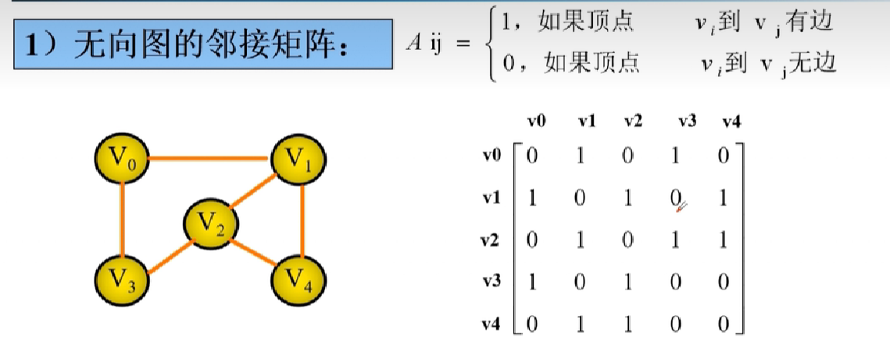
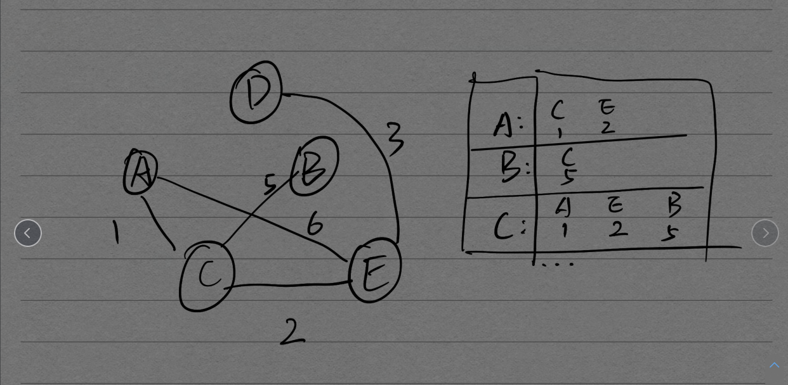
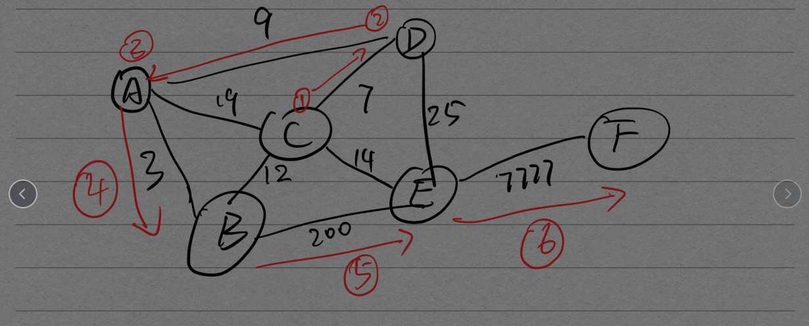
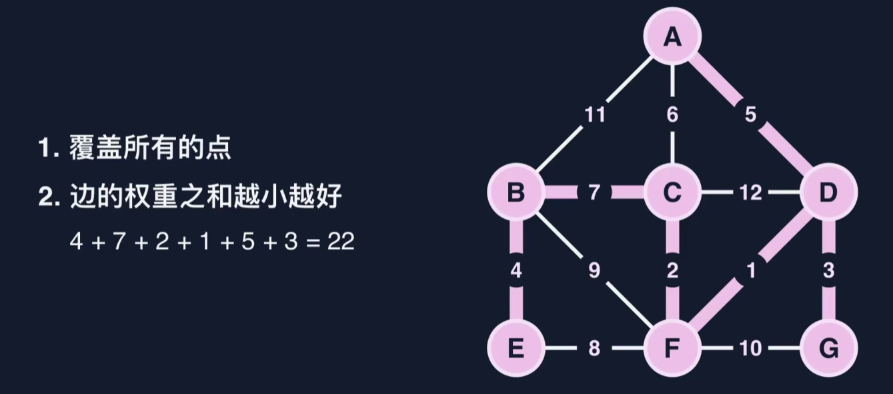
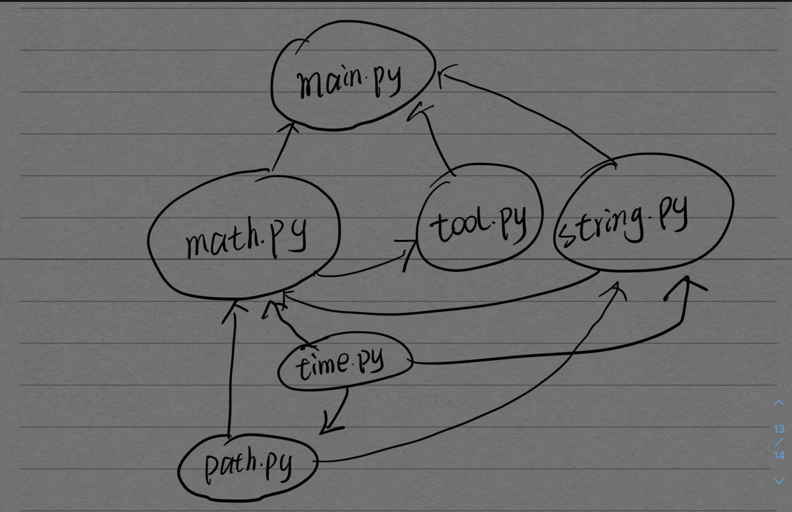

# 图

[toc]

---

##术语

*   图(graph) 的定义
    *   图G记作G=<V,E>
        *   V: vertex 顶点集
        *   E: Eged 边集
        *   G1 = {V1, E1}
        *   V1 = {v1, v2, v3, ...}
        *   E1 = {(v1, v2), (v2, v3), ...}


*   有向图和无向图
    *   有向图
        *   边是有方向的; 用尖括号
        *   E1 = {<v1, v2>, <v2, v3>, ...}
    *   无向图
        *   边是无方向的; 用小括号
        *   E1 = {(v1, v2), (v2, v3), ...}
*   网
    *   边上所带的值成为权
    *   边上带权的图成为网
    *   可分为有向网和无向网
*   有向完全图
    *   图中任意两点都又两条相反的弧连接; n个顶点有n(n-1)条边

*   无向完全图
    *   任意两个点都有边直接相连
*   稠密图和稀疏图
    *   接近于完全图的图成为稠密图; 边数很少的图成为稀疏图
*   邻接和关联
    *   有变直接相邻的两个点互为邻接点； 两点之间的关系
        *   V1和V2有边相连 则 V1和V2互为邻接点
    *   连接两点的边称为两点的
        *   V1和V2有边相连 则 边(v1, v2)关联V1, v2

*   度, 入度, 出度
    *   度
        *   关联与某顶点V的边的数量
    *   入度
        *   以某顶点V为**终点**的有向边数量
    *   出度
        *   以某顶点V为**起点**的有向边数量
    *   有向图中顶点的度为出度和入度之和
    *   在边数为e的图中的度数和为2*e
*   路径相关
    *   路径
        *   多条边组成的序列
    *   路径的长度
        *   无权图中为路径上的边数; 带权图中为带权路径权的总和
    *   回路(环)
        *   起点和终点相同的路劲
    *   简单路劲
        *   **起点和终点可以相同**外其他的点顶点均不相同; 即其他顶点不重复走第二次
    *   简单回路(简单环)
        *   **起点和终点相同**外其他的点顶点均不相同; 即其他顶点不重复走第二次

*   连通图和强连通图
    *   连通图
        *   在无向图中；任意的两个点都能通过某个路劲到达则称图为连通图
    *   强连通图
        *   针对有限图的连通图
*   子图
    *   原图的一部分
*   连通分量
    *   极大的连通子图; 再任意加入一个顶点就不连通
*   强连通分量
    *   针对有向图的连通分量
*   极小连通分量
    *   一个极小连通分量再删除任意一条边, 图就不连通了
    *   技校连通分量是没有回路的

## ADT 图

*   邻接矩阵
    *   
    *   无向完全图的邻接矩阵是对称的; 在存储时可以进行压缩
    *   每个顶点的度 都是该行1的个数
    *   如果边是带权的则将图中的1改为对应权
    *   在有向邻接矩阵中; 行对应的1的个数是出度值，列对应的1的入度值
    *   特点
        *   不适合删除和插入顶点
        *   不适合存储稀疏图
        *   时间复杂度为$O(n^2)$

*   邻接表
    *   
    *   将每个顶点的邻接点都记录在一个行中; 也可以储存权信息

*   图的ADT方式不止两种，有很多。

*   邻接表其中一种实现代码
    *   见下面狄克斯特拉算法↓


---

## 狄克斯特拉算法

*   在带权无向图中；给定一个点；输入该点到其他所有点的最短路径权值

*   解题思路

    1.    维护一个字典；key为目标点，value初始值设为None 不可达
    2.    从当前点开始，依次看它到邻接点的权值和起点到本身的权值之和是否小于到该点的原有的权值；小于则更新邻接点的值； 如果邻接点的值为None同样更新
    3.    完成后，从该点的路径中选择一个目标点未锁定，且权值最小的路径；
    4.    完成一个顶点的检测后将它锁定；依次执行上诉操作 直到图中每个点都遍历一次

*   实现代码

    *   ```python
        # 定义vertex类
        class Vertex():
            def __init__(self, value):
                self.value = value
                self.nexts = {}
            
            def addNext(self, to, weight = None):
                self.nexts[to] = weight
            
            def getNext(self):
                # return self.nexts.keys()
                return self.nexts.items()
        
        class Graph():
            def __init__(self):
                self.vertexs = []
                self.vertexValue = []
        
            def addVertex(self, value):
                tempVertex = Vertex(value)
                self.vertexValue.append(value)
                self.vertexs.append(tempVertex)
        
            def addEdge(self, From, to, weight = None):
                for i in self.vertexs:
                    if i.value == From:
                        i.addNext(to, weight)
                    if i.value == to:
                        i.addNext(From, weight)
        
            def getNexts(self, value):
                for i in self.vertexs:
                    if i.value == value:
                        return i.getNext()
        
            def getVertex(self, value):
                '''
                    通过所给value值 返回顶点的地址
                '''
                for i in self.vertexs:
                    if i.value == value:
                        return i
        
            def getVertexNum(self):
                return len(self.vertexValue)
        
            def Dij(self, begin):
                result = {}
                locked = []
                for i in self.vertexValue:  # 初始化  其余点到起点的距离都置为None
                    result[i] = None
                    if i == begin:          # 到自己的距离置为0
                        result[i] = 0
                
                # 最开始定义一个变量指向出发点
                tempVertex = self.getVertex(begin)
                locked.append(tempVertex.value)
        
                while len(locked) < self.getVertexNum():
                    minWeight = None
                    minNext = None
                    for i in tempVertex.nexts:
                        if (minWeight == None or minWeight > tempVertex.nexts[i]) and i not in locked:
                            minNext = i
                            minWeight = tempVertex.nexts[i]
                        if result[i] == None or result[i] > result[tempVertex.value] + tempVertex.nexts[i]:
                            result[i] = result[tempVertex.value] + tempVertex.nexts[i]
                    
                    # 选择一条权值最小的路径 继续以上操作
                    tempVertex = self.getVertex(minNext)
                    locked.append(tempVertex.value)
        
                return result
        
        
        if __name__ == '__main__':
            myGraph = Graph()
            myGraph.addVertex('A')
            myGraph.addVertex('B')
            myGraph.addVertex('C')
            myGraph.addVertex('D')
            myGraph.addVertex('E')
            myGraph.addVertex('F')
            myGraph.addEdge('A', 'B', 3)
            myGraph.addEdge('A', 'C', 19)
            myGraph.addEdge('A', 'D', 9)
            myGraph.addEdge('C', 'D', 7)
            myGraph.addEdge('C', 'B', 12)
            myGraph.addEdge('C', 'E', 14)
            myGraph.addEdge('E', 'F', 7777)
            myGraph.addEdge('E', 'B', 200)
            myGraph.addEdge('E', 'D', 20)
        
        
            result = myGraph.Dij('A')
            for i in result:
                print(f"A点到{i}的最短距离为{result[i]}")
            print("-"*30)
            result = myGraph.Dij('C')
            for i in result:
                print(f"C点到{i}的最短距离为{result[i]}")
        ```

    *   

---

## 图的遍历

### 深度优先遍历DFS

*   实现代码

    *   ```python
        def DFS(self, begin):
            global searched, tempStack
        
            tempStack = Stack()
            searched = set()
        
            # 初始化
            tempVertex = self.getVertex(begin)
            
            searched.add(begin)
            self.DFSfunc(tempVertex)
        
            while not tempStack.isEmpty():
                print(f"{tempStack.pop()} - ", end = '')
        
        def DFSfunc(self, tempVertex):
            global searched, tempStack
        
            tempStack.push(tempVertex.item)
        
            for i in tempVertex.nexts:
                if i not in searched:
                    searched.add(i)
                    self.DFSfunc(self.getVertex(i))
        ```


### 广度优先遍历BFS

*   实现代码

    *   ```python
        def BFS(self, begin):
            tempQueue = Queue()
            searched = set()
            unSearched = set()
            
            # 指定遍历起始点
            for i in self.vertexs:
                unSearched.add(i.item)
                if i.item == begin:
                    tempVertex = i
        
            tempQueue.push(tempVertex)
            while not tempQueue.isEmpty():
                tempVertex = tempQueue.pop()
                print(tempVertex.item, end = ' - ')
                for i in tempVertex.nexts:
                    if i not in searched:
                        searched.add(i)
                        unSearched.remove(i)
                        tempQueue.push(self.getVertex(i))
        ```


---

## 最小生成树MST

*   Minimum Spanning Tree

*   针对无向网

*   生成树是原图的一个极小连通子图；(再加入任意一条边就会产生回路)
*   生成树的节点和原图的节点相等n; 有n条边的原图最小生成树的边为n-1

---

### K算法

*   实现步骤
    1.   为每个节点都建立一个集合
    2.   将边集按权值的升序排列
    3.   依次(从小到大)考察每一条边；如果边的两头From和To不在同一个集合里，那么这条边就是最后生成树里的边,将两边的点所在集合合并，边加入最后的生成树；如果在同一个集合里则该边不合法(会使树出现环)
    4.   直到所有的边考察完毕  (或者一个集合中的节点个数等于节点集长度)

*   实现代码

    *   ```python
        # 比较器
        def cmp(a, b):
            if a.Weight > b.Weight:
                return True
            return False
        
        # 堆排序
        def heapSort(List):
            # heapInsert  升序  创建大根堆
            for i in range(len(List)):
                j = i
                while j > 0 and cmp(List[j], List[(j-1)//2]):
                    List[j], List[(j-1)//2] = List[(j-1)//2], List[j]
                    j = (j-1)//2
            
            # 开始排序
            deep = len(List)-1
            while deep > 0 :
                List[deep], List[0] = List[0], List[deep]
                deep -= 1
                
                # heapify
                i = 0
                j = 2*i+1
                while j <= deep:
                    if j+1 <= deep and cmp(List[j+1], List[j]):
                        j = j+1
        
                    if cmp(List[i], List[j]):
                        break
                    else:
                        List[i], List[j] = List[j], List[i]
                        i = j
                        j = 2*i+1
        
        # 实现Vertex
        class Vertex():
            def __init__(self, item):
                self.item = item
        
        # 实现Edge
        class Edge():
            def __init__(self, From, To, Weight):
                self.From = From
                self.To = To
                self.Weight = Weight
        
        # 实现Graph
        class Graph():
            def __init__(self):
                self.vertexs = []
                self.edges = []
                self.vSize = 0
        
            def addVertex(self, item):
                tempVertex = Vertex(item)
                self.vertexs.append(tempVertex)
                self.vSize += 1
        
            def addEdge(self, From, To, Weight):
                tempEdge = Edge(From, To, Weight)
                self.edges.append(tempEdge)
            
            def getVertex(self, item):
                for i in self.vertexs:
                    if i.item == item:
                        return i
        
            def MST(self):
                # 为每个节点都建立一个集合
                sets = []
                result = []
                cost = 0
                for i in self.vertexs:
                    sets.append({i})
                # 边排序
                heapSort(self.edges)
                for tempEdge in self.edges:
                    From = self.getVertex(tempEdge.From)
                    To = self.getVertex(tempEdge.To)
                    # 找到两个点的所在集合
                    for i in sets:
                        if From in i:
                            a = i
                        if To in i:
                            b = i
                    if a == b:
                        continue
                    else:
                        a |= b
                        sets.remove(b)
                        result.append(tempEdge)
                        cost += tempEdge.Weight
                    if len(sets) == 1:
                        break
        
                return cost, result
        if __name__ == '__main__':
            myGraph = Graph()
            myGraph.addVertex('A')
            myGraph.addVertex('B')
            myGraph.addVertex('C')
            myGraph.addVertex('D')
            myGraph.addVertex('E')
            myGraph.addVertex('F')
            myGraph.addVertex('G')
            
            myGraph.addEdge('A', 'B', 11)
            myGraph.addEdge('A', 'C', 6)
            myGraph.addEdge('A', 'D', 5)
            myGraph.addEdge('B', 'C', 7)
            myGraph.addEdge('C', 'D', 12)
            myGraph.addEdge('B', 'E', 4)
            myGraph.addEdge('B', 'F', 9)
            myGraph.addEdge('C', 'F', 2)
            myGraph.addEdge('D', 'F', 1)
            myGraph.addEdge('E', 'F', 8)
            myGraph.addEdge('G', 'F', 10)
            myGraph.addEdge('D', 'G', 3)
        
            cost, result = myGraph.MST()
        
            print(f"MST的开销是{cost}")
        ```

    *   测试数据

        *   

---

### P算法

*   实现步骤
    1.   指定一个起始点, 将该点所发散的边解锁；将点加入已处理点合
    2.   将已经解锁的边加入优先级堆(小根堆)中；弹出堆边，如果该边两头有一个点是未在已处理集合中,则将该边加入MST的边集，将点加入已处理点集合，并解锁该点所里连接的边；不合法就继续弹出堆顶
    3.   重复2知道所有点均在已处理点集中;此时边集中的边所组成的树即为所求MST

*   实现代码

    *   ```python
        def P_MST(self):
            doneSet = set()
            unsettleSet = set()
            cost = 0
            result = []
            # doneEdge = []
            # 1.指定一个起始点, 将该点所发散的边解锁；将点加入已处理点合
            unsettleSet = {i for i in self.vertexs}
            curVertex = self.vertexs[0]
            
            myHeap = []
            
            doneSet.add(curVertex)
            unsettleSet.remove(curVertex)   
            
            while len(unsettleSet):
                for i in self.edges:
                    if (i.From == curVertex.item or i.To == curVertex.item) \
                        and \
                        (self.getVertex(i.From) not in doneSet or self.getVertex(i.To) not in doneSet):  
                        # 解锁已处理点所以关联的边;  至少有一边的点没有处理过
                        insertSort(myHeap,i) # 函数功能为追加i 并且用插入排序让边集升序
        
                # 选择一个合法的边处理
                while True:
                    tempEdge = myHeap.pop(0)
                    if self.getVertex(tempEdge.From) not in doneSet:
                        cost += tempEdge.Weight
                        result.append(tempEdge)
                        curVertex = self.getVertex(tempEdge.From)
                        doneSet.add(curVertex)
                        unsettleSet.remove(curVertex)
                        break
                    elif self.getVertex(tempEdge.To) not in doneSet:
                        cost += tempEdge.Weight
                        result.append(tempEdge)
                        curVertex = self.getVertex(tempEdge.To)
                        doneSet.add(curVertex)
                        unsettleSet.remove(curVertex)
                        break
            return cost, result
        ```


---

## 拓扑排序

*   只适用于**有向无环图DAG**

*   实现步骤

    1.   一个DAG中至少存在一个入度为0的点；擦掉入度为0的点
    2.   并且擦掉这些点的有向边；更新边另一头的节点的入度
    3.   如此这般直到图中所有的点入度都为0；擦除的顺序就为最后排序的顺序(队列)

*   实现代码

    *   ```python
        from collections import deque
        # Vertex实现
        class Vertex():
            def __init__(self, item):
                self.item = item
                self.toNexts = []
                self.indegree = 0
        
            def addEdge(self, To):
                self.toNexts.append(To)
            
            def addIndegree(self):
                self.indegree += 1
        # Graph实现
        class Graph():
            def __init__(self):
                self.vertexs = []
            
            def addVertex(self, item):
                tempVertex = Vertex(item)
                self.vertexs.append(tempVertex)
            
            def addEdge(self, From, To):
                for i in self.vertexs:
                    if i.item == From:
                        i.addEdge(To)
                    if i.item == To:
                        i.addIndegree()
        
            def getVertex(self, item):
                for i in self.vertexs:
                    if i.item == item:
                        return i
        
            def topoSort(self):
                result = deque()
                tempList = []
                for i in self.vertexs:
                    tempList.append([i, i.indegree])
                
                print(tempList)
                while len(tempList) != 0:
                    for i in tempList:
                        if i[1] == 0:     # 找到剩下列表中入度为0的点
                            result.append(i[0])    # 把该点入队
                            for x in i[0].toNexts:# 擦除该点的影响
                                for j in tempList:
                                    if x == j[0].item:
                                        j[1] -= 1 
                            tempList.remove(i)
                            continue
                return result     
        
        if __name__ == '__main__':
            myGraph = Graph()
            
            # 添加节点
            myGraph.addVertex("math.py")
            myGraph.addVertex("tool.py")
            myGraph.addVertex("string.py")
            myGraph.addVertex("path.py")
            myGraph.addVertex("time.py")
            myGraph.addVertex("main.py")
        
            # 添加边
            myGraph.addEdge("math.py", 'tool.py')
            myGraph.addEdge("time.py", "math.py")
            myGraph.addEdge("time.py", "path.py")
            myGraph.addEdge("time.py", "string.py")
            myGraph.addEdge("string.py", "math.py")
            myGraph.addEdge("path.py", "math.py")
            myGraph.addEdge("path.py", "string.py")
            myGraph.addEdge("math.py", "main.py")
            myGraph.addEdge("tool.py", "main.py")
            myGraph.addEdge("string.py", "main.py")
        
            result = myGraph.topoSort()
            print("文件的编译顺序为: ", end = '')
            while len(result) != 0:
                print(f" {result.popleft().item} ", end = '->')
        ```

    *   测试数据

        *   


## N皇后问题(DFS 回溯)

*   问题描述

    *   n皇后问题
    *   要在n*n的矩阵中放下n个皇后，要求每个皇后之间都不能共列、不能共行、不能共斜线
    *   输入一个n 输出在这个n阶矩阵中有多少种合法的放法
    *   n=8 输出 92 
    
*   处理步骤

    1.   定义一个N阶矩阵开始DFS每一个点
    2.   如果一个点是合法的则从该点开始继续DFS；直到n列都被合法的点放上皇后
    3.   回溯到DFS之前 开始这一列下一个点的测试；如此这般

    *   任意两点点不共行
        *   因为成功DFS到最的矩阵中，每一行都只要一个皇后且是逐行DFS的，所以不用考虑会出现共行的情况
    *   任意两点不共列
        *   依次遍历 
    *   任意两点不共斜线
        *   两点的x之差和y之差相等；斜率为斜率为45或135度

*   实现代码

    *   ```python
        def isValid(x, y):
            for i in range(n):
                if Map[i][y] == 1:
                    return False
            for i in range(n):
                for j in range(n):
                    if Map[i][j] == 1 and abs(x-i) == abs(y-j):
                        return False
            return True
        def dfs(x):
            global count
            if x == n:
                count += 1
                return 
            for y in range(n):
                if isValid(x, y):
                    Map[x][y] = 1
                    dfs(x+1)
                    Map[x][y] = 0
            
        if __name__ == '__main__':
            n = int(input("n = "))
            count = 0
            Map = [[None for i in range(n)] for j in range(n)]
            dfs(0)
            print(f"{n}阶矩阵有{count}种摆法")
        ```


---

## 单词

*   graph  图
*   vertex  顶点
*   matrix  矩阵
*   minimum  最小的
*   spanning  生成
*    acyclic  非循环的，无环的
*    Trie  前缀树
*    inquire  查询

*   valid  有效的，合法的

*   backtrack  回溯


