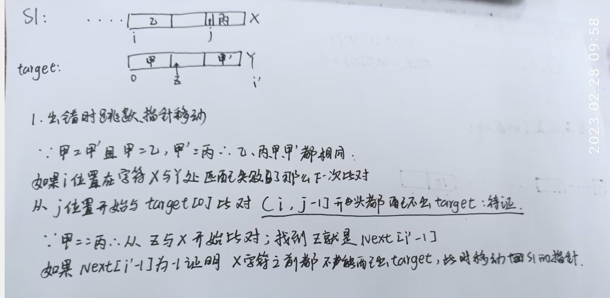
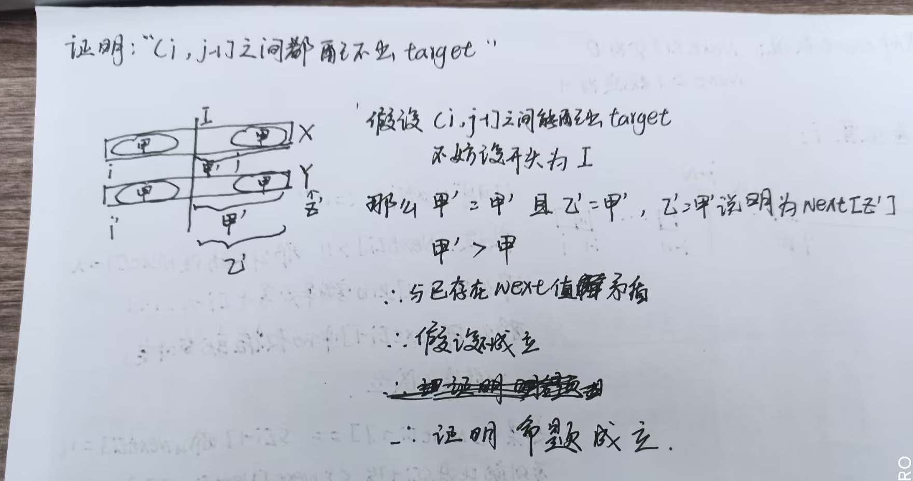
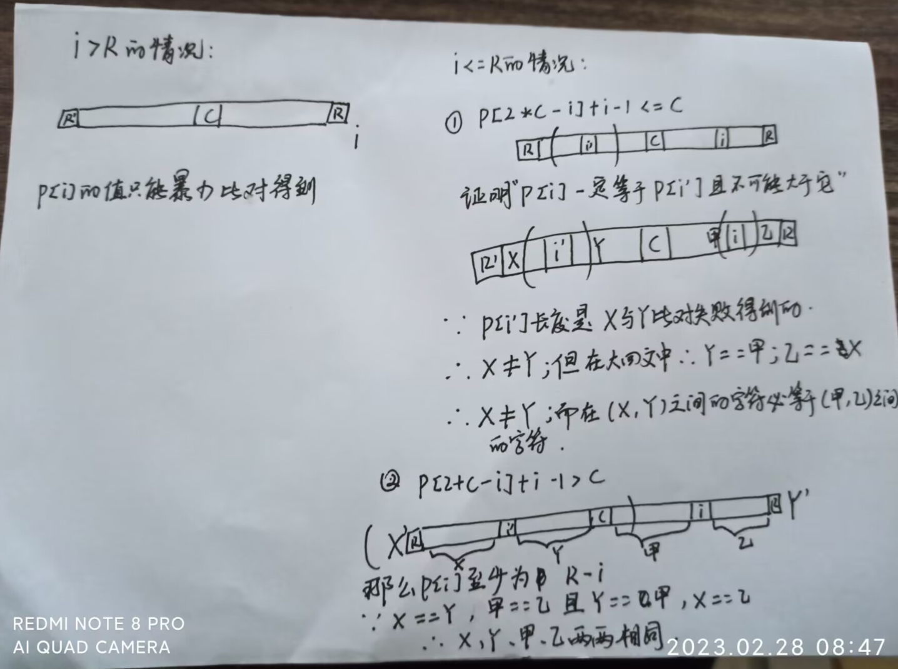

# 06字符串

[toc]

---

## KMP:star:

*   问题描述
    *   [问题地址](https://leetcode.cn/problems/find-the-index-of-the-first-occurrence-in-a-string/description/)


*   KMP思路
    *   next数组:字符串s中每个位置的最长相同前后缀信息；(长度必须小于当前之前的所有字符和的长度)
        *   在字符串'123123A'中 'A'位置的信息为3; 字符串'aaaaaA'中 'A'位置的信息4
        *   一个位置的next值和当前位上的字符无关
        *   next数组位置上值的含义1.当前字符最长相同前后缀长度；2.如果当前位置比对失败，那么将指针移动到哪一个
    *   next数组的求解:
        *   规定next[0] = -1；next[1]一定为0；求解普遍位置i的next值就是比对s[i - 1]字符与哪一个合适的相同字符匹配；
        *   先比对s[i - 1] 和 next[i - 1]的值是否相等，如果相等那么next[i] = next[i - 1] + 1
        *   不相等那么指针就跳到next[i - 1]再次判断next[next[i - 1] - 1]是否与s[i - 1]相等
        *   一路都不相等就会遇到-1 那么当前位置next值就是0
    *   借助next数组加速比对过程：
        *   开始的流程和暴力解一样以字符串的每一位作为开头逐位比对，直到目标串全部比对完
        *   不同的是，当遇到不同字符时，将目标串的指针移动到当前next值的位置继续匹配
        *   移动的实质和证明：
        *   
        *   


*   实现代码


    *   ```python
        
            class Solution:
                def strStr(self, haystack: str, needle: str) -> int:
                    M = len(haystack)
                    N = len(needle)
            
                    if N > M:
                        return -1
                    
                    def getNextArry(s):
                        if len(s) == 1:
                            return [-1]
                        next = [0] * len(s)
                        next[0] = -1
                        next[1] = 0
                        
                        for i in range(2, len(s)):
                            now = next[i - 1]
                            while now != -1:
                                if s[i - 1] == s[now]:
                                    next[i] = now + 1
                                    break
                                else:
                                    # punchline
                                    now = next[now]
            
                        return next
                    
                    next = getNextArry(needle)
                    # punchline  求next数组
                    p1 = p2 = 0
                    while p1 < len(haystack) and p2 < len(needle):
                        if haystack[p1] == needle[p2]:
                            p1 += 1
                            p2 += 1
                        elif next[p2] != -1:
                            p2 = next[p2]
                        else:
                            p1 += 1
            
                    if p2 == len(needle):
                        return p1 - p2
                    return -1
        ```


---

## Manacher:star:

*   问题描述
    *   [问题地址](https://leetcode.cn/problems/longest-palindromic-substring/description/)
*   解题思路
    *   暴力方法：以每一位为中心向两头扩散知道双指针所指字符不相同，因为最终结果的中心可能在两个下标之间 例如:"112211"，所以每个位置都还需要特殊遍历一次 时间复杂度$O(N^2)$
    *   Manacher:大体思想和暴力一致，分别计算每个位置作为回文中心能得到的最长回文长度，不同的是，manacher中一个位置的信息可以通过之前的信息加速获得;
    *   每个位置保存的都是最长当前位置为中心的最长回文半径：例如：'010'中1位置的回文半径长为2
    *   加工字符串：为了解决回文中心处于两个字符之间的情况，在原字符串之间和前后都插入一个相同的字符；例如 '1221' --> '#1#1#2#2#1#1#' ；插入的字符也可以是存在于原字符串中，因为在后续的比较过程中插入字符永远是和插入字符做比较，不会影响到原字符串的对称性
    *   最右回文右边界R、最右回文中心C：最右回文又边界是指处理到一个字符时，它之前的所有位置中回文最靠右的边界及其中心；这两个变量在遍历时不断尝试更新；初值都置为-1
    *   **计算每个位置的信息：计算每个位置的信息要判断当前位置和当前R的位置关系；**
        *   如果当前位置i > R，那么只能暴力扩展，无法通过前置信息加速
        *   如果i <= r:判断i关于C对称的点i’的长度信息p[2 * C - i]
            *   如果p[2 * C - i] + i - 1 <= C: 那么p[i] = p[2 * C - i]；即p[i']的范围被**包括在**[R, R']中
            *   如果p[2 * C - i] + i - 1 > C: 那么p[i] = p[R - i] + 暴力扩展；即p[i']的范围**超过**[R, R']
        *   证：
        *   
    *   注意：得到的信息是出入字符处理后的长度，在还原是需要进行偏移计算，注意边界情况


-   实现代码

    -   ```python
        class Solution:
            def longestPalindrome(self, s: str) -> str:
                # manacher
                N = len(s)
                if N < 2:
                    return s   
        
                # 先处理
                s = '#' + '#'.join(s) + '#'
                N = len(s)
        
                p = [0] * N
                maxLen = -sys.maxsize
                res = None
                        
                C = R = -1
                for i in range(N):
                # 求解每个位置的最长半径
                    if i > R:
                        # 暴力破解
                        p[i] = 0
                    else:
                        p[i] = min(p[R - i], p[C * 2 - i])
                    
                    while i - p[i] - 1 >= 0 and i + p[i] + 1 < N and s[i - p[i] - 1] == s[i + p[i] + 1]:
                        p[i] += 1
        
                    if i + p[i] > R:
                        R = i + p[i]
                        C = i
                    if p[i] > maxLen:
                        res = i
                        maxLen = p[i]
                
                resS = s[res - maxLen + 1:res + maxLen].replace('#', '')
                return resS
        ```


## leetCode43 字符串相乘

*   问题描述
    *   [问题地址](https://leetcode.cn/problems/multiply-strings/)

-   解题思路

    -   模拟乘法列式运算的过程；为了减少常数时间，舍去每次相乘都进位的方案，改成每次相乘信息直接累加到对应列，最后进行一次进位
    -   结果数组的长度最长是N1 + N2；3位数乘以3位数结果最大为6位数 3 + 3；4位数乘5位数结果最大为9位数`l:7`

-   实现代码

    -   ```python
        class Solution:
            def multiply(self, num1: str, num2: str) -> str:
                if num1 == '0' or num2 =='0':
                    return '0'
                N1 = len(num1)
                N2 = len(num2)
                res = [0] * (N1 + N2)
                
                num1 = num1[::-1]
                num2 = num2[::-1]
        
                for j in range(N1):
                    b = int(num1[j])
                    for i in range(N2):
                        a = int(num2[i])
                        res[i + j] += a * b
                
                res.reverse()
                
                # 进位
                i = len(res) - 1
                while i >= 0:
                    res[i - 1] += res[i] // 10
                    res[i] %= 10
                    i -= 1
                res = [str(i) for i in res]
                res = ''.join(res).lstrip('0')
                return res
        ```


