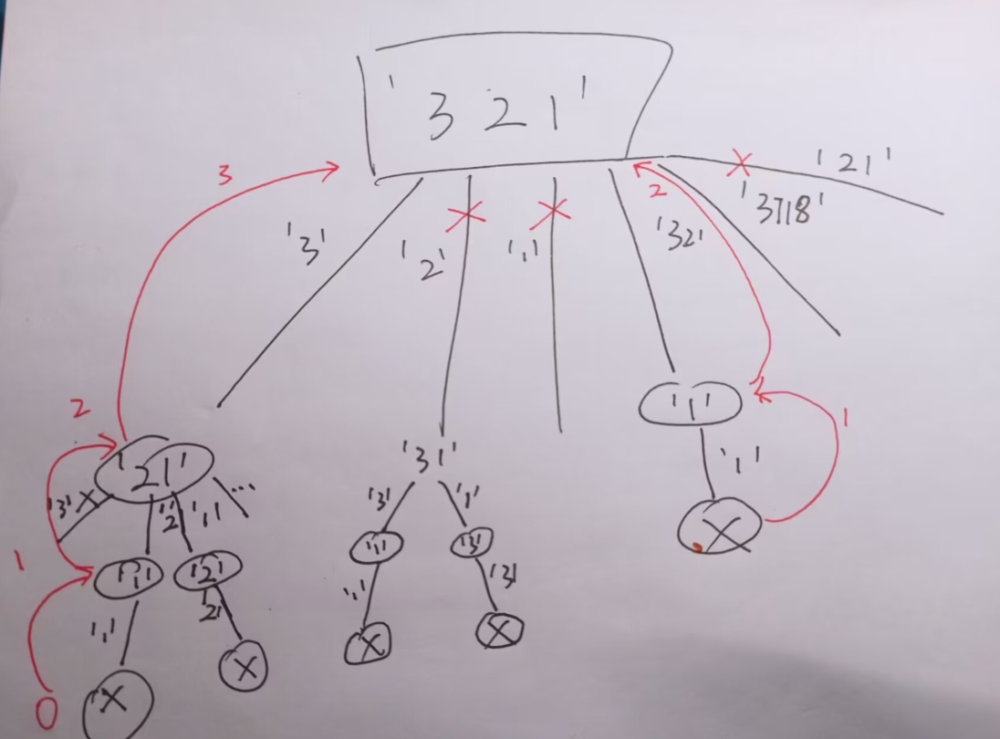
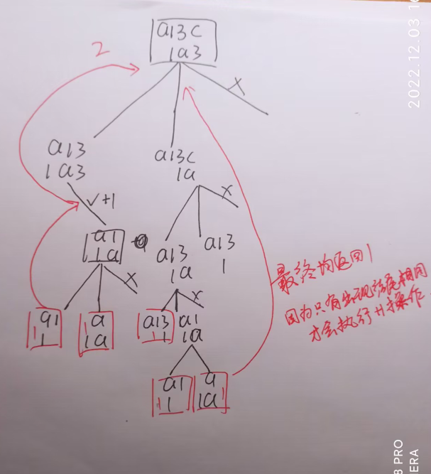
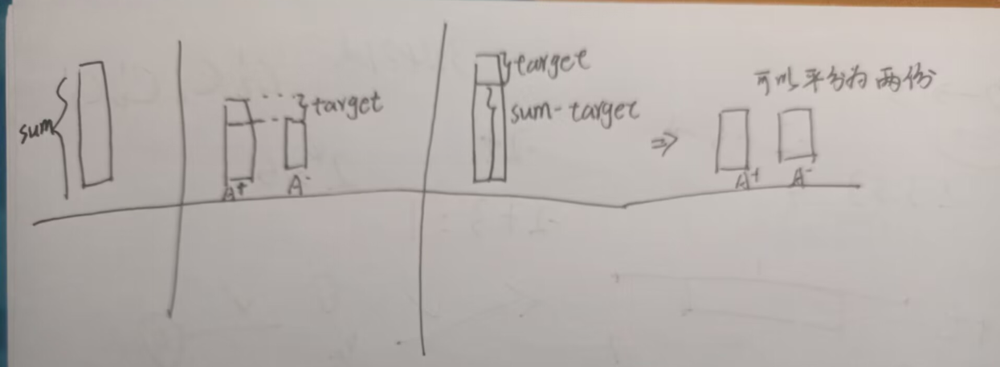
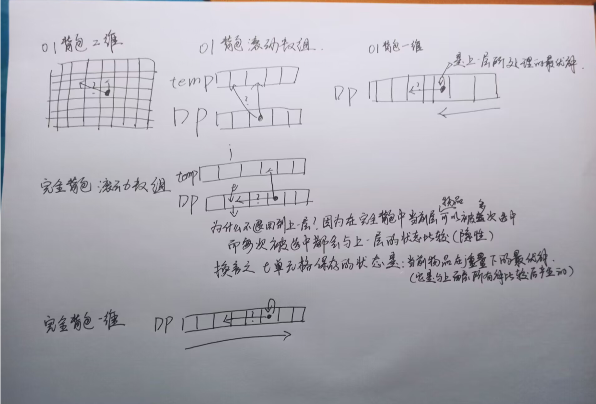
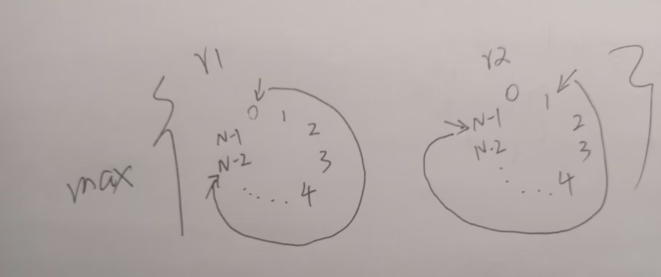

# 	动态规划DP

[toc]


---


---

## 机器人走路

*   问题描述

    *   假设有排成一行的N个位置，记为[1, N]，N一定大于或等于2开始时机器人在其中的S位置上(S一定是1-N中的一个)

        如果机器人来到1位置，那么下一步只能往右来到2位置﹔

        如果机器人来到N位置，那么下一步只能往左来到N-1位置;

        如果机器人来到中间位置，那么下一步可以往左走或者往右走;

        规定机器人必须走K步，最终能来到A位置(A也是1~N中的一个)的方法有多少种给定四个参数N、S、K、A，返回方法数。

*   解题思路1 尝试
    1.   定义一个递归函数
    2.   基类为当步数为0
         *   如果步数为0当前的位置就是目的地 则找到一种方法返回；
         *   否则返回0
    3.   如果当前点为两个边界点
         *   为1点：那么它到目的地的方法数就是 2 到该点的方法数；递归调用2位置，并步数- 1
         *   为N点：同理；递归调用N - 1，步数- 1
    4.   如果为普遍点
         *   那么就要考虑两个相邻点的情况
         *   它的方法数为左、右边邻点到目的地的总和

*   实现代码

    *   ```python
        count = 0
        def func(N, S, K, A):
            global count
            '''
            N : 可以走动地范围
            S : 当前起始点
            K : 当前剩余的步数
            A : 目的地
            '''
            # base case
            print(f"({S}, {K})")
            count += 1
            if K == 0:
                if S == A:
                    return 1
                return 0 # 步数为0时 只有起点和终点重合才有一种方式.
            if S == 1:
                return func(N, 2, K - 1, A)
            elif S == N:
                return func(N, S - 1, K - 1, A)
            else:
                return func(N, S - 1, K - 1, A) + func(N, S + 1, K - 1, A)
        print(f"{'=' * 20}\n共{func(4, 2, 4, 4)}种走法")
        print(f"总处理次数:{count}")
        ```


*   优化思路1

    1.   创建一个记录表
         *   申请一个记录表; 表的列表示步数 [0, K], 行表示起点 范围[1, N]，-1表示该单元格没有被处理过
    2.   当每次调用函数时都查表；看当前调用所对应的单元格是否已经处理过
         *   如果已经处理过，怎么就返回对应单元格的值
         *   未处理过，就按上诉步骤处理，处理后将对应单元格赋值

*   实现代码

    *   ```python
        # 记忆存储
        N = 4
        S = 2
        A = 4
        K = 4
        # 申请一个记录表; 表的列表示步数 [0, K], 行表示起点 范围[1, N]
        # -1表示该单元格没有被处理过
        tMap = [[-1 for i in range(K + 1)] for j in range(N)]
        
        global count
        count = 0
        def func(N, S, K, A):
            global count
            if tMap[S - 1][K] != -1:
                return tMap[S - 1][K]
            # 以下代码是在该点没有处理过的情况下处理的
            print(f"({S}, {K})")
            count += 1
            res = 0
            if K == 0:
                if S == A:
                    res = 1
            elif S == 1:
                res = func(N, 2, K - 1, A)
            elif S == N:
                res = func(N, N - 1, K - 1, A)
            else:
                res = func(N, S - 1, K - 1, A) + func(N, S + 1, K - 1, A)
            tMap[S - 1][K] = res
            return res
            
        func(N, S, K, A)
        print(f"{'=' * 20}\n共{tMap[S - 1][K]}种走法")
        print(f"总处理次数:{count}")
        ```

*   优化后可以节省许多重复处理过的子问题

*   动态规划版本
    *   直接生成一张完整的记录表，并填满该表
    *   更加尝试方法的代码，弄清楚每个单元格的依赖关系

*   实现代码

    *   ```python
        N = 4
        S = 2
        A = 4
        K = 4
        # 初始化一张记录表；表的列表示步数 [0, K], 行表示起点 范围[1, N]
        tMap = [[0 for i in range(K + 1)] for j in range(N)]
        
        # 初始化第一列的数据; 除了 A 行的单元格为1其余行为0; 
        # 对应代码
            # if K == 0:
            #     if S == A:
            #         res = 1
        tMap[A - 1][0] = 1
        
        # 开始填剩余单元格
        for j in range(1, K + 1):
            # 单元格依赖: 
            # 第一行的单元格依赖左下角的单元格
            # 对应代码
                # if S == 1:
                #   return func(N, 2, K - 1, A)
            # 最后一行的单元格依赖为左上角的单元格
            # 对应代码
                # elif S == N:
                #   return func(N, S - 1, K - 1, A)
            # 其余行单元格的依赖为当前单元格的左上角和左下角的和
            # 对应代码
                # return func(N, S - 1, K - 1, A) + func(N, S + 1, K - 1, A)
            tMap[0][j] = tMap[1][j - 1]
            for i in range(1, N - 1):
                tMap[i][j] = tMap[i - 1][j - 1] + tMap[i + 1][j - 1]
            tMap[N - 1][j] = tMap[N - 2][j - 1]
        
        print(tMap[S - 1][K])
        ```

---

## 拿牌博弈

*   问题描述

    *   给定一个整型数组arr，代表数值不同的纸牌排成一条线玩家A和玩家B依次拿走每张纸牌

        规定玩家A先拿，玩家B后拿

        但是每个玩家每次只能拿走最左或最右的纸牌玩家A和玩家B都绝顶聪明

        请返回最后获胜者的分数。

*   解题思路

    *   定义两个函数；
        *   一个先手函数
        *   一个后手函数
    *   先手函数中
        *   基类
            *   当只剩一张牌时，就拿这张牌
        *   普遍情况时
            *   情况1： 拿左边的牌 + 拿完后剩余牌后手拿的最大值
            *   情况2： 拿右边的牌 + 拿完后剩余牌后手拿的最大值
            *   返回两种情况中的较大值
    *   后手函数中
        *   基类
            *   当只剩一张牌时，就不拿 值为0
        *   普遍情况时
            *   情况1：对手走左边的牌；那么就在剩余牌中先手拿的最优解
            *   情况2：对手走右边的牌；那么就在剩余牌中先手拿的最优解
            *   返回两种情况中的较小值
            *   因为是对手先选，所以不可能选到最好情况 
    
*   实现代码

    ```python
    # 给定一个整型数组arr，代表数值不同的纸牌排成一条线玩家A和玩家B依次拿走每张纸牌
    # 规定玩家A先拿，玩家B后拿
    # 但是每个玩家每次只能拿走最左或最右的纸牌玩家A和玩家B都绝顶聪明
    # 请返回最后获胜者的分数。
    pokers = [5, 7, 4, 5, 8, 1, 6, 0, 3, 4, 1, 7]
    
    def fFunc(L, R):
        if L == R:
            return pokers[L]
        r1 = pokers[L] + sFunc(L + 1, R)
        r2 = pokers[R] + sFunc(L, R - 1)
        return max(r1, r2)
    
    def sFunc(L, R):
        if L == R:
            return 0
        r1 = fFunc(L + 1, R)
        r2 = fFunc(L, R - 1)
        return min(r1, r2)
    
    fPlayerScore = fFunc(0, len(pokers) - 1)
    sPlayerScore = sum(pokers) - fPlayerScore
    
    print(f"先手玩家的最优分数为:{fPlayerScore}\n后手玩家的最优分数为:{sPlayerScore}")
    # sPlayerScore = sFunc(0, len(pokers) - 1)
    # print(sPlayerScore)
    ```

*   优化思路1

    *   生成两张记录表；分别记录先手的每个起点到终点的最优选择值,后手表同理
        *   表的长和宽都是[0, N]
    *   在每次调用函数时都查找所对应表的对应单元格是否已经处理过
        *   处理过直接返回单元格值
        *   否则；按正常步骤处理，处理完后将对应表的对应单元格赋值

*   实现代码

    *   ```
        # 存储
        pokers = [5, 7, 4, 5, 8, 1, 6, 0, 3, 4, 1, 7]
        N = len(pokers) - 1
        # 生成两张记录表；分别记录先手的每个起点到终点的最优选择值,后手表同理
        # 表的长和宽都是[0, N]
        fMap = [[-1 for i in range(N + 1)] for j in range(N + 1)]
        sMap = [[-1 for i in range(N + 1)] for j in range(N + 1)]
        
        def fFunc(L, R):
            if fMap[L][R] != -1:
                return fMap[L][R]
            
            # 以下代码为当前单元格没有处理过时处理步骤
            if L == R:
                res = pokers[L]
            else:
                p1 = pokers[L] + sFunc(L + 1, R)
                p2 = pokers[R] + sFunc(L, R - 1)
                res = max(p1, p2)
            fMap[L][R] = res
            return res
        def sFunc(L, R):
            if sMap[L][R] != -1:
                return sMap[L][R]   
            if L == R:
                res = 0
            else:
                r1 = fFunc(L + 1, R)
                r2 = fFunc(L, R - 1)
                res = min(r1, r2)
        
            sMap[L][R] = res
            return res
        
        fPlayerScore = fFunc(0, len(pokers) - 1)
        sPlayerScore = sum(pokers) - fPlayerScore
        print(f"先手玩家的最优分数为:{fPlayerScore}\n后手玩家的最优分数为:{sPlayerScore}")
        ```


*   动态规划版本

    *   生成两张表；并按依赖关系填满两张表

*   实现代码

    *   ```python
        pokers = [5, 7, 4, 5, 8, 1, 6, 0, 3, 4, 1, 7]
        N = len(pokers) - 1
        
        # 生成两张记录表；分别记录先手的每个起点到终点的最优选择值,后手表同理
        # 表的长和宽都是[0, N]
        fMap = [[-1 for i in range(N + 1)] for j in range(N + 1)]
        sMap = [[-1 for i in range(N + 1)] for j in range(N + 1)]
        
        # 开始填两张表
        
        # 两表的左上到右下的对角线即为 L == R 的情况
            # 先手表即为poker[L]
            # 后手表即为0
        for i in range(N):
            fMap[i][i] = pokers[i]
            sMap[i][i] = 0
        
        # 其他单元格的依赖关系
            # 当L > R时无意义即对角线以下的单元格两个表都不会用到
            # 先手表中非对角线的单元格依赖是 它在后手表中的相对位置  
            # 下面的单元格与poker[L]之和  和 左边单元格与pokers[R]之和 两者的较大值
            # 对应代码
                # p1 = pokers[L] + sFunc(L + 1, R)
                # p2 = pokers[R] + sFunc(L, R - 1)
                # res = max(p1, p2)
            # 后手表同样的逻辑推得
        
        for j in range(1, N + 1): # 从第二列开始
            col = j
            row = 0
            while col <= N:
                fMap[row][col] = max(pokers[row] + sMap[row + 1][col], pokers[col] + sMap[row][col - 1])
                sMap[row][col] = min(fMap[row + 1][col], fMap[row][col - 1])
                col += 1
                row += 1
        print(fMap[0][N])
        ```

---

## 0/1背包问题

*   问题描述

    *   给定两个列表；分别表示对应位置物品的w重量和v价值
    *   并且给定一个背包容量；求在背包容量允许范围内，能装下物品的最大价值总和

*   解题思路 尝试

    *   可以将每个位置的物品分为拿和不拿两种情况
        *   拿的话要先判断当前容量是否能拿
        *   如果可以则价值1位  当前物品的价值 + 剩余物品中取w-当前物品重量的价值
        *   不拿的话就说 就递归调用后面的物品

*   注意

    *   当递归到边界时，有时会产生无效解，如果将无效解返回给上层调用，则会出错
    *   所以在返回时带上能标识当前解是否有效的标识
    *   或者在进入下一次调用之前采取判断

*   实现代码

    *   ```python
        bagWei = 15
        
        w = [3, 2, 4, 7, 3, 1, 7]
        v = [5, 6, 3, 19, 12, 4, 2]
        
        count = 0
        def func(nowInd, restW):
            global count
            # base case
            if restW < 0 or nowInd == len(w):
                return 0
            print(f"({nowInd}, {restW})")
            count += 1
        
            # 用r1 和 r2 分别记录是否选择当前物品的价值
            r1 = 0
            if restW >= w[nowInd]:
                r1 = v[nowInd] + func(nowInd + 1, restW - w[nowInd])
            
            r2 = func(nowInd + 1, restW)
            return max(r1, r2)
        print(func(0, bagWei))
        print(f"共计算处理{count}次")
        ```

    *   结果42 共处理113次

    *   其中有许多子问题被大量重复处理


*   优化思路1

    *   创建一张记录表，记录每一次入参的状态，并查找、记录对应单元格

*   实现代码

    *   ```python
        bagWei = 15
        
        w = [3, 2, 4, 7, 3, 1, 7]
        v = [5, 6, 3, 19, 12, 4, 2]
        
        tMap = [[-1 for i in range(bagWei + 1)] for j in w]
        
        count = 0
        def func(nowInd, restW):
            global count
            # base case
            if restW < 0 or nowInd == len(w):
                return 0
            
        
            if tMap[nowInd][restW] != -1:
                return tMap[nowInd][restW]
        
        
        
        
            print(f"({nowInd}, {restW})")
            count += 1
        
            # 用r1 和 r2 分别记录是否选择当前物品的价值
            r1 = 0
            if restW >= w[nowInd]:
                r1 = v[nowInd] + func(nowInd + 1, restW - w[nowInd])
            
            r2 = func(nowInd + 1, restW)
            tMap[nowInd][restW] = max(r1, r2)
            return tMap[nowInd][restW]
        
        print(func(0, bagWei))
        print(f"共计算处理{count}次")
        ```

    *   答案42 共处理59次

    *   用空间换时间


*   动态规划版本

    *   依赖关系，最后一行
        *   如果准备表的高度为[0, N]那么最后一行为全0
        *   如果准备表的高度为[0, N-1] 那么当列下标小于对应重量时为0，大于等于是时为对应价值
    *   普遍行
        *   如果能当前列下标大于等于对应物品的重量那么 r1就是下一行单元格左侧某个单元格的值(取决于当前物品的重量) + 对应物品的价值
        *   小于的话，就对应无法拿当前物品的情况 r1 = 0
        *   r2 为当前单元格正下方的单元格

*   实现代码

    *   ```python
        bagWei = 15
        
        w = [3, 2, 4, 7, 3, 1, 7]
        v = [5, 6, 3, 19, 12, 4, 2]
        
        tMap = [[-1 for i in range(bagWei + 1)] for j in w]
        # 先填最后一行
        t = False
        for i in range(bagWei + 1):
            if i >= w[-1]:
                t = True
            if t:
                tMap[-1][i] = v[-1]
            else:
                tMap[-1][i] = 0
        # 也可以准备[0, N]高度的表，最后一行置为0 
        
        
        # 填普遍行
        # 普遍行的依赖是当前单元格下面的单元格和下一行左侧的某个单元格
        for i in range(len(w) - 2, -1, -1):
            for j in range(bagWei + 1):
                # 判断单元格是否有拿与不拿两种选择
                if w[i] > j:
                    r1 = 0
                else:
                    r1 = tMap[i + 1][j - w[i]] + v[i]
                r2 = tMap[i + 1][j]
                tMap[i][j] = max(r1, r2)
        
        print(tMap[0][bagWei])
        ```


---

## leetCode91 数字解码英文

*   问题描述

    *   1对应A，2对应B，3对应C...10对应J...26对应Z
    *   给定一个数字串(可能出现前导0) 输出共有多少种解码结果
    *   例如：
        *   '111' 可解码为 ‘AAA', 'AK', 'KA'    返回3
        *   ’101‘ 可解码为 'JA'    返回1

    *   [问题地址](https://leetcode.cn/problems/decode-ways/)

*   解题思路_尝试

    *   当前字符可以单独解码，也有可能和后面的一个字符解码

    *   单独解码的前提是当前字符不为'0'
        *   如果为‘0’那么单独解码的可能性就是0
    *   和后一个字符解码的前提是两者转为数值必须<=26
    *   每个位置都有 一种或者两种可能性
        *   单独解码的可能性为 递归i+1位置的可能性
        *   组合解码的可能性为 递归i+2位置的可能性
    *   当当前的下标超过了字符串边界；正面之前的组合方式都是合法的方法数返回1
    *   例如：
        *   '1101' 如果是以’11‘   ’0‘   ‘1’ 当走到'0'是就返回了0  无法走到最后越界的位置
        *   '1101'如果是以'1'    '10'    '1'当走到'1'时它会继续调用 i+1出的递归，最终来到了越界的位置，证明是一条合法的路径

*   实现代码

    *   ```python
        # string = '7210231231232031203123'
        string = '110'
        
        def tryFunc(nowInd):
            if nowInd == len(string):
                return 1
            
            if string[nowInd] == '0':
                return 0
            r1 = tryFunc(nowInd + 1)
            r2 = 0
            if nowInd != len(string)-1 and int(string[nowInd:nowInd + 2]) <= 26:
                r2 = tryFunc(nowInd + 2)
            return r1 + r2
        print(tryFunc(0))
        ```


*   实现代码_记忆化搜索

    *   ```python
        string = "305"
        
        tMap = [-1 for _ in range(len(string))]
        
        def tryFunc(nowInd):
        
            if nowInd == len(string):
                return 1
        
            if tMap[nowInd] != -1:
                return tMap[nowInd]
            
            if string[nowInd] == '0':
                tMap[nowInd] = 0
                return tMap[nowInd]
            
            r1 = tryFunc(nowInd + 1)
            r2 = 0
            if nowInd != len(string)-1 and int(string[nowInd:nowInd + 2]) <= 26:
                r2 = tryFunc(nowInd + 2)
            
            tMap[nowInd] = r1 + r2
            return tMap[nowInd]
        print(tryFunc(0))
        ```


*   动态规划版本

    *   从右往左依次填表
    *   依赖关系可根据上诉代码分析出来

*   实现代码

    *   ```python
        class Solution:
            def numDecodings(self, s: str) -> int:
                tMap = [-1 for _ in range(len(s) + 1)]
                tMap[-1] = 1
                for i in range(len(s) - 1, -1, -1): # 从右往左填表
                    if s[i] == '0':
                        tMap[i] = 0
                        continue
                    r1 = tMap[i + 1]
                    r2 = 0 
                    if i < len(s) - 1 and int(s[i:i + 2]) <= 26:
                        r2 = tMap[i + 2]
                    tMap[i] = r1 + r2
                return tMap[0]
        ```


---

## leetCode691 贴纸剪字符串

*   问题描述

    *   [问题地址](https://leetcode.cn/problems/stickers-to-spell-word/)

*   解题思路_DFS

    *   每一层都尝试贴纸列表中的每一个贴纸
    *   将能成功让当前字符串减少的字符串进行下一次递归
    *   当某一层的所有贴纸都无法让当前字符串减少 那么就返回 -1让上层知道 该路径无法拼出目标字符串
    *   如果当前字符串为空串证明走到了叶子节点成功找到了一条路径返回0 (在依次返回的过程中每一层都会+1)最后根节点会收集到当前层能走通的所有层数
    *   最后返回每一层能走通的最小值 即为 最小高度， 即为最小贴纸数量

*   实现代码

    *   ```python
        target = "atomher"
        stickers = ["these","guess","about","garden","him"]
        
        def DFS(nowStr):
            if nowStr == '':
                return 0
            counts = []
            for i in stickers:
                tempStr = nowStr
                for j in i:
                    tempStr = tempStr.replace(j, '', 1)
                minusLen = len(nowStr) - len(tempStr)
                if minusLen == 0:
                    continue
                next = DFS(tempStr)
                if next == -1:# 下一层走不通
                    continue
                else:
                    counts.append(next + 1)
            if counts == []:
                return -1
            else:
                return min(counts)
        print(DFS(target))
        ```

*   加缓存法 实现代码

    *   ```python
        target = "stoodcrease"
        stickers = ["control","heart","interest","stream","sentence","soil","wonder","them","month","slip","table","miss","boat","speak","figure","no","perhaps","twenty","throw","rich","capital","save","method","store","meant","life","oil","string","song","food","am","who","fat","if","put","path","come","grow","box","great","word","object","stead","common","fresh","the","operate","where","road","mean"]
        # target = "thehat"
        # stickers = ["with","example","science"]
        
        tMap = {}
        def DFS(nowStr):
            if nowStr == '':
                return 0
            if tMap.get(nowStr) != None:
                return tMap[nowStr]
            counts = []
            for i in stickers:
                tempStr = nowStr
                for j in i:
                    tempStr = tempStr.replace(j, '', 1)
                if len(tempStr) != len(nowStr): # 当前贴纸能有效的拼出原字符的一部分
                    next = DFS(tempStr) # 获取它下面的情况 看该节点往下是否能走通
                    if next == -1:  # 走该条路径往下走不通
                        tMap[nowStr] = - 1
                        return tMap[nowStr] # 同一层的其他贴纸也不需要继续试下去了
                    else:
                        counts.append(next + 1) # 走该条路径拼出当前状态的其中一条路径的高度
            if counts == []:    # 证明在所有贴纸中都拼不出当期字符串
                tMap[nowStr] = - 1
                return tMap[nowStr]
            else:
                tMap[nowStr] = min(counts)
                return tMap[nowStr]
        DFS(target)
        print(tMap[target])
        ```

*   优化

    *   剪枝优化

        *   因为只要求输出最小张数 并没有要求顺序，所以正确的情况下路径上的节点顺序无所谓
        *   所以在每一层尝试进入下一次递归时，都只尝试那些包含当前字符串某个特定位置的字符(以下代码使用首字符)的贴纸
        *   

        *   图中可以看出'3' - '2' - '1' 路径 和'2' - '3' - '1' 路径其实是同一种剪法

    *   实现代码

        *   ```python
            counts = []
                for i in stickers:
                    tempStr = nowStr
                    # punchline
                    if nowStr[0] in i:
                        tempStr = minus(tempStr, i)
                        deep = DFS(tempStr)
                        if deep == -1:
                            return -1
                        else:
                            counts.append(deep + 1)
            
                if counts == []:
                    return -1
                else:
                    tMap[nowStr] = min(counts)
                    return tMap[nowStr]
            ```

    *   minus函数

        *   ```python
            def minus(s, sticker):
                temp = {}
                for i in s:
                    temp[i] = temp.get(i, 0) + 1
                for i in sticker:
                    if temp.get(i) != None:
                        temp[i] -= 1
                tempS = ""
                for i in temp:
                    if temp[i] > 0:
                        tempS += i * temp[i]
                return tempS
            ```

    *   用上面同一组数据；没优化之前的tMap的长度为640，而剪枝优化后长度可以减少到130

*   **由此题可以知道，并不是所有的动态规划类型题目都能实现成某个维度的数组**
*   **有时候优化到记忆化存储即可**

---

## leetCode1143 最长公共子序列

*   问题描述
    *   [问题地址](https://leetcode.cn/problems/longest-common-subsequence/description/)
    *   最长公共子序列不唯一
        *   例如:'a13c' '1a3'  最长公共子序列为 '13' 或者 'a3'

*   解题思路
    *   base case: 当两字符串下标中的只有一个移动到0位置时，判断0位置字符是否出现在另一个字符串0到当时对应的范围内`l:6 11`
        					如果两个下标同时指向0 那么将就判断他们是否相等`l:4`
    *   普遍情况下可以将当前两个下标所指的字符分为三种模型
        *   其中之一属于公共子序列
            *   如果考虑其一属于公共子序列但是最后却不属于也不会影响结果，因为会取最大值
            *   考虑错了一定会取到较小
        *   两个都属于公共子序列
            *   那么就讲当前看 在当前两下标之前的最大公共子序列长度  在加上当前位置的1`l:17`
            *   且这种情况下一定比上面两种情况都要长，所以可以直接返回
    *   

*   实现代码

    *   ```python
        # 递归函数返回 字符串1 [0:x+1] 位置上 和 字符串2 [0:y+1] 上的最长公共子序列
        def func(x, y):
            if x == 0 and y == 0:
                return 1 if text2[0] == text1[0] else 0
            elif x == 0:
                if text1[0] in text2[0:y + 1]:
                    return 1
                else:
                    return func(x, y - 1)
            elif y == 0:
                if text2[0] in text1[0:x + 1]:
                    return 1
                else:
                    return func(x - 1, y)     
            else:# 分成三种模型
                r1 = 0
                if text1[x] == text2[y]: # 两字符串最后一个字符串相同
                    return = func(x - 1, y - 1) + 1
                r2 = func(x - 1, y)
                r3 = func(x, y - 1) 
                return max(r1, r2, r3)
        print(func(len(text1) - 1, len(text2) - 1))
        ```


*   优化思路
    *   根据尝试版本的代码分析清楚基类位置的值，和普遍位置的依赖关系，最后用正确的遍历方式输出

*   动态规划实现代码

    *   ```python
        DP = [[-1 for y in range(len(text2))] for x in range(len(text1))]
        DP[0][0] = 1 if text1[0] == text2[0] else 0
        for y in range(1, len(text2)):
            if text1[0] == text2[y]:
                DP[0][y] = 1
            else:
                DP[0][y] = DP[0][y - 1]
        for x in range(1, len(text1)):
            if text2[0] == text1[x]:
                DP[x][0] = 1
            else:
                DP[x][0] = DP[x - 1][0]
        
        # 普遍位置依赖
        for x in range(1, len(text1)):
            for y in range(1, len(text2)):
                r1 = 0
                if text1[x] == text2[y]:
                    DP[x][y] = DP[x - 1][y - 1] + 1
                    continue    # 如果两字符串末尾相同 那么该种模型下的子串最长
                r2 = DP[x - 1][y]
                r3 = DP[x][y - 1]
                DP[x][y] = max(r1, r2, r3)
        
        print(DP[len(text1) - 1][len(text2) - 1])
        ```

*   **该题题为样本对应模型，一般样本对应模型考虑如何组织当前位置可能性(经验)**


---

## leetCode516 最长回文子序列

*   问题描述

    *   求给定字符串的最大回文子序列的长度
    *   [问题地址](https://leetcode.cn/problems/longest-palindromic-subsequence/description/)

*   解题思路

    *   利用上一题
        *   求字符串和它逆序串的最长公共子序列，就是原字符串的最长回文子序列

    *   同上一题
    *   不同的是在这题是在一个字符串中，且讨论的是一个字符串开头和结尾的情况，所以必须分清所有的可能性！

*   尝试代码

    *   ```python
        s = "abcdef"
        # s = 'aba'
        
        def tryFunc(i, j):
            if i == j:
                return 1
            elif i + 1 == j:
                if s[i] == s[j]:
                    return 2
                else:
                    return 1
            r0 = 0
            if s[i] == s[j]:
                r0 = tryFunc(i + 1, j - 1) + 2
            r3 = tryFunc(i + 1, j - 1)
            r1 = tryFunc(i + 1, j)
            r2 = tryFunc(i, j - 1)
            return max(r1, r2, r0, r3)
        print(tryFunc(0, len(s) - 1))
        ```

*   记忆化搜索

    *   ```python
        # s = "abcdef"
        s = "euazbipzncptldueeuechubrcourfpftcebikrxhybkymimgvldiwqvkszfycvqyvtiwfckexmowcxztkfyzqovbtmzpxojfofbvwnncajvrvdbvjhcrameamcfmcoxryjukhpljwszknhiypvyskmsujkuggpztltpgoczafmfelahqwjbhxtjmebnymdyxoeodqmvkxittxjnlltmoobsgzdfhismogqfpfhvqnxeuosjqqalvwhsidgiavcatjjgeztrjuoixxxoznklcxolgpuktirmduxdywwlbikaqkqajzbsjvdgjcnbtfksqhquiwnwflkldgdrqrnwmshdpykicozfowmumzeuznolmgjlltypyufpzjpuvucmesnnrwppheizkapovoloneaxpfinaontwtdqsdvzmqlgkdxlbeguackbdkftzbnynmcejtwudocemcfnuzbttcoew"
        tMap = {}
        def tryFunc(i, j):
            if tMap.get(s[i:j+1]) != None:
                return tMap[s[i:j+1]]
            if i == j:
                tMap[s[i:j+1]] = 1
                return tMap[s[i:j+1]]
            elif i + 1 == j:
                if s[i] == s[j]:
                    tMap[s[i:j+1]] = 2
                    return tMap[s[i:j+1]]
                else:
                    tMap[s[i:j+1]] = 1
                    return tMap[s[i:j+1]]   
            r0 = 0
            if s[i] == s[j]:
                r0 = tryFunc(i + 1, j - 1) + 2
            r3 = tryFunc(i + 1, j - 1)
            r1 = tryFunc(i + 1, j)
            r2 = tryFunc(i, j - 1)
            tMap[s[i:j+1]] = max(r1, r2, r0, r3)
            return tMap[s[i:j+1]]
        print(tryFunc(0, len(s) - 1))
        ```


*   动态规划

    *   ```python
        s = "abcdef"
        s = "euazbipzncptldueeuechubrcourfpftcebikrxhybkymimgvldiwqvkszfycvqyvtiwfckexmowcxztkfyzqovbtmzpxojfofbvwnncajvrvdbvjhcrameamcfmcoxryjukhpljwszknhiypvyskmsujkuggpztltpgoczafmfelahqwjbhxtjmebnymdyxoeodqmvkxittxjnlltmoobsgzdfhismogqfpfhvqnxeuosjqqalvwhsidgiavcatjjgeztrjuoixxxoznklcxolgpuktirmduxdywwlbikaqkqajzbsjvdgjcnbtfksqhquiwnwflkldgdrqrnwmshdpykicozfowmumzeuznolmgjlltypyufpzjpuvucmesnnrwppheizkapovoloneaxpfinaontwtdqsdvzmqlgkdxlbeguackbdkftzbnynmcejtwudocemcfnuzbttcoew"
        
        DP = [[-1 for i in range(len(s))] for j in range(len(s))]
        
        for i in range(len(s)):
            DP[i][i] = 1
            if i == len(s) - 1:
                break
            DP[i][i + 1] = 2 if s[i] == s[i + 1] else 1
        
        for i in range(len(s) - 2, -1, -1): # 从最后一行开始填
            for j in range(i + 2, len(s)):
                r2 = DP[i][j - 1]
                r3 = DP[i + 1][j]
                DP[i][j] = max(r3, r2)
                if s[i] == s[j]:
                    DP[i][j] = max(DP[i][j], DP[i + 1][j - 1] + 2)
        
        print(DP[0][len(s) - 1])
        ```


---

## 马走日

*   问题描述

    *   有一个竖线为9 横线为10的棋盘；给定一个棋盘上的坐标x、y和步数k； 将从左下角(0, 0)出发走k步走到(x, y)所以走法输出

*   解题思路_暴力递归

    *   从起始点开始，步数为0时只能解锁本身
    *   步数+1 看从当前的所有点能够延升出那些点；（这些点就算出现重复值也无所谓，因为它之前的路径是不同的）
    *   步数一直累加到k，最后看在最后结果中出现了多少个x,y

*   实现代码

    *   ```python
        # 棋盘横线9  竖线10
        x = 7
        y = 7
        k = 10
        
        # DP数组初始化
        DP = {}
        for i in range(k + 1):
            DP[i] = []
        DP[0].append([0, 0])
        
        # 填写过程
        m = 1
        while m <= k:
            for i in DP[m - 1]: 
                if i[0] < 0 or i[0] > 8 or i[1] < 0 or i[1] > 9:    # 越界的情况
                    continue
                else:
                    DP[m].append([i[0] + 2, i[1] + 1])
                    DP[m].append([i[0] + 2, i[1] - 1])
                    DP[m].append([i[0] - 2, i[1] + 1])
                    DP[m].append([i[0] - 2, i[1] - 1])
                    
                    DP[m].append([i[0] + 1, i[1] + 2])
                    DP[m].append([i[0] + 1, i[1] - 2])
                    DP[m].append([i[0] - 1, i[1] + 2])
                    DP[m].append([i[0] - 1, i[1] - 2])
            m += 1
        # m = 1
        # while m <= k:
        #     for i in DP[m - 1]:
        #         # 当前点上面的情况
        #         if 0 <= i[0] - 2 <= 8:  # 上面有至少2行
        #             if 0 <= i[1] - 1 <= 9:  # 左边有至少1列
        #                 DP[m].append([i[0] - 2, i[1] - 1])
        #             if 0 <= i[1] + 1 <= 9:
        #                 DP[m].append([i[0] - 2, i[1] + 1])
        
        #             if 0 <= i[1] + 2 <= 9:  # 左边有至少2列
        #                 DP[m].append([i[0] - 1, i[1] + 2])
        #             if 0 <= i[1] - 2 <= 9:
        #                 DP[m].append([i[0] - 1, i[1] - 2])
        
        #         elif 0 <= i[0] - 1 <= 8:  # 上面有至少1行
        #             if 0 <= i[1] - 2 <= 9:  # 左边有至少2列
        #                 DP[m].append([i[0] - 1, i[1] - 2])
        #             if 0 <= i[1] + 2 <= 9:
        #                 DP[m].append([i[0] - 1, i[1] + 2])
        #         # 当前点下面的情况
        #         if 0 <= i[0] + 2 <= 8:  # 上面有至少2行
        #             if 0 <= i[1] - 1 <= 9:  # 左边有至少1列
        #                 DP[m].append([i[0] + 2, i[1] - 1])
        #             if 0 <= i[1] + 1 <= 9:
        #                 DP[m].append([i[0] + 2, i[1] + 1])
        
        #             if 0 <= i[1] + 2 <= 9:  # 左边有至少2列
        #                 DP[m].append([i[0] + 1, i[1] + 2])
        #             if 0 <= i[1] - 2 <= 9:
        #                 DP[m].append([i[0] + 1, i[1] - 2])
        
        #         elif 0 <= i[0] + 1 <= 8:  # 上面有至少1行
        #             if 0 <= i[1] - 2 <= 9:  # 左边有至少2列
        #                 DP[m].append([i[0] + 1, i[1] - 2])
        #             if 0 <= i[1] + 2 <= 9:
        #                 DP[m].append([i[0] + 1, i[1] + 2])
        #     m += 1
        count = 0
        for i in DP[k]:
            if [x, y] == i:
                count += 1
        print(count)
        ```


*   解题思路_递归尝试

    *   实现一个递归函数, 返回当前坐标走k步到x,y的方法数
    *   如果步数为0那么就判断是否停在了目标点，如果是那么就返回1,1表示当前路径为有效的1条路径；否则返回0表示当前路径到不了目的地
    *   **可以对每个点都调用8个依赖递归函数；如果出现越界的情况，在下一层递归是判断；如果越界就返回0表示此路不通**

*   实现代码

    *   ```python
        # 棋盘横线10  竖线9
        x = 8
        y = 6
        k = 10
        
        def tryFunc(nowX, nowY, rest):
            # punchline
            if nowX < 0 or nowX > 9 or nowY < 0 or nowY > 8:
                return 0
            if nowX == x and nowY == y and rest == 0:
                return 1
            if rest == 0:
                return 0
        
            t1 = tryFunc(nowX + 2, nowY - 1, rest - 1)
            t2 = tryFunc(nowX + 2, nowY + 1, rest - 1)
            t3 = tryFunc(nowX - 2, nowY - 1, rest - 1)
            t4 = tryFunc(nowX - 2, nowY + 1, rest - 1)
            t5 = tryFunc(nowX + 1, nowY - 2, rest - 1)
            t6 = tryFunc(nowX + 1, nowY + 2, rest - 1)
            t7 = tryFunc(nowX - 1, nowY - 2, rest - 1)
            t8 = tryFunc(nowX - 1, nowY + 2, rest - 1)
            return t1 + t2 + t3 + t4 + t5 + t6 + t7 + t8 
        print(tryFunc(0, 0, k))
        ```


*   解题思路_动态规划
    *   因为有三个可变参数，x，y的变化范围是对应列宽和行高；k的可变范围是怕[0, k]
    *   所以构建一个三维表；
    *   在最后一层就是basecase的情况，除了x,y点为1其余全为0
    *   **以后的每一层都依赖下一层的对应8个点(如果出现越界的情况可以借鉴上面的代码思路，定义一个pick函数用于越界判断和取值)**

*   实现代码

    *   ```python
        # 棋盘横线10  竖线9
        x = 8
        y = 6
        k = 10
        
        DP = [[[0 for j in range(9)] for i in range(10)] for z in range(k + 1)]
        DP[0][x][y] = 1
        
        
        # punchline
        def pick(z, x, y):
            if x < 0 or x > 9 or y < 0 or y > 8:
                return 0
            return DP[z][x][y]
        
        for z in range(1, k + 1):
            for i in range(10):
                for j in range(9):
                    DP[z][i][j] += pick(z - 1, i + 2, j + 1)
                    DP[z][i][j] += pick(z - 1, i + 2, j - 1)
                    DP[z][i][j] += pick(z - 1, i - 2, j + 1)
                    DP[z][i][j] += pick(z - 1, i - 2, j - 1)
        
                    DP[z][i][j] += pick(z - 1, i + 1, j + 2)
                    DP[z][i][j] += pick(z - 1, i + 1, j - 2)
                    DP[z][i][j] += pick(z - 1, i - 1, j + 2)
                    DP[z][i][j] += pick(z - 1, i - 1, j - 2)
        print(DP[k][0][0])
        ```

*   暴力尝试的时间复杂度是$O(8^k)$而DP版本的时间复杂度是n * m * k(n m是行高和列宽  为常数)所以它的时间复杂度为$O(k)$
*   空间换时间

---

## leetCode70 爬楼梯

*   问题描述
    *   [问题地址](https://leetcode.cn/problems/climbing-stairs/)

*   解题思路
    *   将楼梯从0到n - 1编号；到达n证明楼梯爬完了返回1；证明之前的路径是正确的
    *   如果为 n + 1证明在最后一阶的时候采用了上2阶的策略；无效返回0
    *   从n - 1开始到0 都属于普遍位置依赖，依赖上面的一阶和上面的第二阶
    *   从而改出动态规划版本 

*   实现代码

    *   ```python
        class Solution:
            def climbStairs(self, n: int) -> int:
                DP = [0 for _ in range(n + 2)]
                DP[-1] = 0  # 超出两阶
                DP[-2] = 1  # 超出一阶
                
                for i in range(n - 1, -1, -1):
                    DP[i] = DP[i + 1] + DP[i + 2]
        
                return DP[0]
        ```

*   尝试版本代码

    *   ```python
        def func(now):
            if now == n:
                return 1
            if now > n:
                return 0
            
            return func(now + 1) + func(now + 2)
        
        print(func(0))
        ```

​	

---

## leetCode746 爬楼梯最小花费

*   问题描述
    *   [问题地址](https://leetcode.cn/problems/min-cost-climbing-stairs/)

*   解题思路
    *   定义递归函数；给定一个位置，返回该位置到顶部的最小花费
    *   当下标大于数组最大下标时，表示已经走到了顶部；最后一阶采用两步和一步都是等效的所以都返回0
    *   一开始是在0号楼梯之下的，所以下标从-1开始
    *   普遍位置依赖为对应台阶花费 + 后一阶到顶部 和 后面第二阶到顶部 两者花费的较小值
    *   改DP表时，多出两个存储空间用于存储，超过一阶和超过两阶的情况，这样一来所有位置都属于普遍位置依赖
    *   注意一开始是在0号楼梯之下的，所以在调用DP表的时候不能返回DP[0] 而是和其他位置一样做决策;DP[0]和DP[1]中的较小值;一开始的花费是0

*   实现代码_尝试

    *   ```python
        cost = [1,100,1,1,1,100,1,1,100,1]
        
        def tryFunc(now):
            if now >= len(cost):
                return 0
            # 选择第一步是上一阶还是两阶
            if now == -1:
                return  min(tryFunc(now + 1), tryFunc(now + 2))
            p1 = cost[now] + tryFunc(now + 1)
            p2 = cost[now] + tryFunc(now + 2)
            return min(p1, p2)
        print(tryFunc(-1))
        ```

*   实现代码_DP

    *   ```python
        if len(cost) == 1:
            return cost[0]
        DP = [0 for _ in range(len(cost) + 2)]
        DP[-1] = DP[-2] = 0
        
        for i in range(len(DP) - 3, -1, -1):
            DP[i] = min(DP[i + 1], DP[i + 2]) + cost[i]
        
        print(min(DP[0], DP[1]))
        ```


---

## leetCode62 不同路径

*   问题描述
    *   [问题地址](https://leetcode.cn/problems/unique-paths/description/)

*   解题思路

    *   马走日简化版

*   实现代码_尝试

    *   ```python
        if m <= 1 and n <= 1:
            return 0
        
        def tryFunc(nowX, nowY):
            if nowX == m or nowY == n:
                return 0
        
            if nowX == m - 1 and nowY == n - 1:
                return 1
            
            return tryFunc(nowX + 1, nowY) + tryFunc(nowX, nowY + 1)
        print(tryFunc(0, 0))

*   实现代码_DP

    *   ```python
        DP = [[0 for j in range(n)] for i in range(m)]
        DP[m - 1][n - 1] = 1
        def get(x, y):
            if x == m or y == n:
                return 0
            return DP[x][y]
        for i in range(m - 1, -1, -1):
            for j in range(n - 1, -1, -1):
                if i == m - 1 and j == n - 1:   # 跳过右下角的格子开始填值
                    continue
                DP[i][j] = get(i + 1, j) + get(i, j + 1)
        print(DP[0][0])
        ```


---

## leetCode63 不同路径II

*   问题描述
    *   [问题地址](https://leetcode.cn/problems/unique-paths-ii/description/)

*   解题思路

    *   和上一题的解题思路一直，单元格位置依赖也一样。不同的是路径上出现了障碍物
    *   所以在取依赖位置的时候，加上一个条件判断，如果是障碍，那么该方向的方法数也是0
    *   单独判断起始位置，因为起始位置是不被任何位置依赖的，所以如果起始位置为障碍物，那么无论后面什么情况，方法数都为0`l: 3`

*   实现代码

    *   ```python
        class Solution:
            def uniquePathsWithObstacles(self, obstacleGrid: List[List[int]]) -> int:
                if obstacleGrid[0][0] == 1:
                    return 0
                DP = [[0 for j in range(len(obstacleGrid[0]))] for i in range(len(obstacleGrid))]
        
                # 开始填表
        
                def pick(x, y):
                    if x < 0 or y < 0 or x == len(obstacleGrid) or y ==len(obstacleGrid[0]) or obstacleGrid[x][y] == 1:
                        return 0
                    return DP[x][y]
                f = 1
                for i in range(len(obstacleGrid) - 1, -1, -1):
                    for j in range(len(obstacleGrid[0]) - 1, -1, -1):
                        if f == 1:
                            DP[-1][-1] = 1
                            f = 0
                            continue
                        DP[i][j] = pick(i + 1, j) + pick(i, j + 1)
        
                return DP[0][0]
        ```

---

## leetCode 343数字拆分最大乘积

*   问题描述
    *   [问题地址](https://leetcode.cn/problems/integer-break/description/)
    *   输入n<=2

*   解题思路

    *   输入n<=2

    *   假设在DP[i] 位置存储这i能**拆出来的**最大乘积

        *   DP[1] = 0, DP[2] = 1, DP[3] = 2

    *   那么要算DP[n] 位置的数字

        1.   如果j从1开始遍历到n - 1，n = j + (n - j)

        2.   分类讨论 n 可能最大为 n = j + DP[n - j], 也可能为 n = j + (n - j)

        3.   即可以选择拆一个数字或者不拆一个数字
        
        4.   例如6 = 3 + 3  =》 3 * 3 = 9，6 = 3 + DP[3] => 3 * 2 = 6
        
        5.   可以发现只有2, 3这两个数，在拆开后的乘积会减小(4才开和不拆的乘积相同为4)
        
        6.   所以可以将2,3特殊处理，将DP中DP[2]和DP[3] 设置为2 和 3表示如果依赖到该数字，就用2和3不拆
        
        7.   这样一来, 在遍历j 1~n-1的时候就能只关心第一乘数的可能性；根据第一个乘数来分类
        8.   第二个乘数会返回它能拆成最大的值；每种最大可能性再求一个最大值，就是DP[n]的值
        9.   在试第一个乘数时可以优化；因为2是最小的不能分割的所以从2开始
        10.   且两个数相加是成对出现的，所以可以到当前数的一半即可
              *   例如6: 1+5、 2+4、 3+3、 4+2、 5+1
              *   优化后7：2 + 5、 3 + 4

*   实现代码

    *   ```python
        class Solution:
            def integerBreak(self, n: int) -> int:
                if n <= 3:
                    return n - 1
                
                DP = [0 for i in range(n + 1)]
                DP[2] = 2
                DP[3] = 3
                
                for i in range(4, n + 1):
                    temp = []
                    for j in range(2, i // 2 + 1):
                        temp.append(j * DP[i - j])
                    DP[i] = max(temp)
                    
                return DP[n]
        ```


---

## leetCode96 不同的二叉搜索树

*   问题描述
    *   [问题地址](https://leetcode.cn/problems/unique-binary-search-trees/description/)

*   解题思路_尝试

    1.   如果现在有一个函数，当你输入一个n，他能返回有n个节点的二叉搜索树的所可能性

    2.   该函数的基类为只有一个节点那么可能性为1, 如果输入为0可能性也为1(下面会解释为什么)
    3.   如果n大于1；不妨设它为5
    4.   那么它的所有可能性就是 以1为头结点的树的可能性，+ 以2为头 + .... + 以5为头的可能性
         *   没一种数字以头结点开头，都能拆分成 左子树节点个数组成二叉搜索树的可能性 * 右子树可能性(排列问题左边m * 右边n种可能性)
         *   因为左右子树可能出现0节点的情况，这时另一边可能性为1；所以基类中加入节点为0时返回1

*   解题思路_DP

    *   生成长度为n + 1的DP数组 初始化为1
    *   现在DP数组下标i的含义是有i节点的搜索树的可能性总数
    *   从2开始
    *   假设现在执行到i(i >= 2), 那么它的所有二叉树可以分类为以1开头,以2开头....以i开头
    *   而计算以j开头时依赖的是之前计算出的DP数组中的值
    *   如此这般便可以实现

*   实现代码

    *   ```python
        class Solution:
            def numTrees(self, n: int) -> int:
                DP = [1 for _ in range(n + 1)]
                for i in range(2, n + 1):
                    sum = 0 
                    for j in range(1, i + 1):   # 分别计算当前数值及之前的数字做头节点的可能性
                        sum += DP[j - 1] * DP[i - j]
                    DP[i] = sum
                return DP[n]
        ```


*   **由以上两题可以得到启发，将一个问题拆分为多个子问题时，可以尝试将子问题进行分类，在明确多个子问题之间的关系**


---

## 01背包滚动数组

*   问题描述
    *   rt
    
*   实现代码

    *   ```python
        bagWei = 15
        w = [3, 2, 4, 7, 3, 1, 7]
        v = [5, 6, 3, 19, 12, 4, 2]
        
        # 先生成最后一行
        i = len(w) - 1
        for j in range(bagWei + 1):
            if j >= w[i]:
                DP[j] = v[i]
            else:
                DP[j] = 0
                
        i -= 1
        temp = DP[:]
        while i >= 0:
            for j in range(bagWei + 1):
                r1 = 0
                if j >= w[i]:
                    r1 = v[i] + temp[j - w[i]]
                r2 = temp[j]
                DP[j] = max(r1, r2)
            temp = DP[:]
            i -= 1
            
        print(DP[-1])
        ```


---

## leetCode416 等和子集

*   问题描述
    *   [问题地址](https://leetcode.cn/problems/partition-equal-subset-sum/description/)

*   实现代码_暴力尝试

    *   ```python
        class Solution:
            def canPartition(self, nums: List[int]) -> bool:
                def tryFunc(nowList,now):
                    if now == len(nums):
                        return False
                    if nowList != None and sum(nowList) * 2 == sum(nums):
                        return True
                    
                    # 要当前数
                    r1 = tryFunc(nowList, now + 1)
                    # 不要当前数
                    r2 = tryFunc(nowList + [nums[now]], now + 1)
                    return r1 or r2
                return tryFunc([], 0)
        # print(tryFunc([], 0))
        ```

*   解题思路
    *   由暴力尝试代码可以发现，如果最后要输出True，那么它的的前提是必须整个集合的总和为偶数，如果为奇数，那么就不可能分割`l: 3-6`
    *   如果为偶数，那么问题就可以简化为，在集合中能否正好平凑出集合总合的一半`target = sum(nums) // 2`
    *   DP尝试代码`l:10-19`
    *   根据尝试推得DP方法
    *   二维DP中行代表的是元素组中的每一个值，列对应的是[0, target]；
    *   每个单元格的意义是，当前行对应的数字，能否在其往后正好拼出j；如果取当前值(前提条件是当前值小于j)，那么可能性就是下一行的（j - 当前行）位置
        如果不取当前值，那么就是下一行的当前位置的值，两种取法去或

*   实现代码_DP

    *   ```python
        class Solution:
            def canPartition(self, nums: List[int]) -> bool:
                target = sum(nums)
                if target % 2 == 1:
                    # 总和为奇数，绝不可能分割出两个等和子集
                    return False
                    # print(False)
        
                target //= 2
                # def func(now,nowT):
                #     if now == len(nums):
                #         return False
                #     if nowT == 0:
                #         return True
                #     r1 = False
                #     if nowT >= nums[now]:
                #         r1 = nums[now] + func(now + 1, nowT - nums[now])
                #     r2 = func(now + 1,nowT)
                #     return r1 or r2
                DP = [[False for t in range(target + 1)] for i in nums]
                for i in range(len(nums)):
                    DP[i][0] = True
        
                for j in range(1, target + 1):
                    # 最后一行先填, 只能组成原位置的值
                    if nums[-1] == j:
                        DP[-1][j] = True
                    else:
                        DP[-1][j] = False
        
                for i in range(len(nums) - 2, -1, -1):
                    for j in range(1, target + 1):
                        r1 = False
                        if nums[i] <= j:
                            r1 = DP[i + 1][j - nums[i]]
                        r2 = DP[i + 1][j]
                        DP[i][j] = r1 or r2
                return DP[0][target]
        ```

*   实现代码_滚动数组

    *   ```python
        class Solution:
            def canPartition(self, nums: List[int]) -> bool:
                
                target = sum(nums)
                if target % 2 == 1:
                    return False
        
                
                target //= 2
                DP = [False for _ in range(target + 1)]
                DP[0] = True
        
                i = len(nums) - 1
                for j in range(1, target + 1):
                    if nums[-1] == j:
                        DP[j] = True
        
                temp = DP[:]
                i -= 1
                while i >= 0:
                    for j in range(1, target + 1):
                        r1 = False
                        if j >= nums[i]:
                            r1 = temp[j - nums[i]]
                        r2 = temp[j]
                        DP[j] = r1 or r2
                    i -= 1
                    temp = DP[:]
                return DP[target]
        ```


---

## leetCode1046 最后一块石头的重量

*   问题描述

    *   [问题地址](https://leetcode.cn/problems/last-stone-weight/description/?languageTags=python3)
    *   注意要求是每次取最大的两个值

*   解题思路

    *   因为每次都需要取出数据中的最大值，而且需要进行新的插入操作，所以可以考虑使用大根堆结构

*   实现代码

    *   ```python
        class Solution:
            def lastStoneWeight(self, stones: List[int]) -> int:
                def heapify(l): # 大根堆
                    deep = len(l) - 1
                    for i in range(deep + 1):
                        j = i
                        while j > 0 and l[j] > l[(j - 1) // 2]:
                            l[j], l[(j - 1) // 2] = l[(j - 1) // 2], l[j]
                            j = (j - 1) // 2
                    return l
        
                def heapinsert(l):
                    deep = len(l) - 1
                    i = 0
                    while i * 2 + 1 <= deep:
                        temp = i * 2 + 1
                        if i * 2 + 2 <= deep and l[i * 2 + 2] > l[temp]:
                            temp = i * 2 + 2
                        if l[i] < l[temp]:
                            l[i], l[temp] = l[temp], l[i]
                            i = temp
                        else:
                            break
        
                heapify(stones)
                # pubchline
                while len(stones) > 1:
                    t = stones.pop(0)
                    heapify(stones)
                    stones[0] = t - stones[0]
                    if stones[0] == 0:
                        stones.pop(0)
                        heapify(stones)
                    else:
                        heapinsert(stones)
        
                if len(stones) == 1:
                    return stones[0]
                else:
                    return 0
        ```

    


---

## leetCode1049 最后一块石头的重量 II

*   问题描述
    *   [问题地址](https://leetcode.cn/problems/last-stone-weight-ii/)

*   解题思路

    *   这题与上一题不同的是，这一题可以取其中任意的两个石头进行粉碎；所以结果会有许多情况，而题目要求输出最优解
    *   例如:[4 ,3 ,4, 2 ,3]
        *   如果为上一题，那么最后的结果为2 即最后剩下一块2的石头
        *   而如果是此题，那么需要做决策使得结果最优，该组数据的最优解是0
    *   解题的关键就是，要想最后一次撞出的石头最小，那么进行粉碎的两个石头就要必须大小接近；
    *   那么就可以所有石头分成**尽可能平均**的两堆，那么它们粉碎出的值，即为最优解
    *   可以求出所有石头的总和的一半(向下取整)，然后看从所有石头中，能否凑出该值，不能的话就取最接近该值的值

*   实现代码

    *   ```python
        class Solution:
            def lastStoneWeightII(self, stones: List[int]) -> int:
                target = sum(stones) // 2
        
                # 从石头中尽量拼凑出于target相近的值
                DP = [False for j in range(target + 1)]
                DP[0] = True
        
                i = len(stones) - 1
                if stones[-1] <= target:
                    DP[stones[-1]] = True
        
                temp = DP[:]
                i -= 1
                while i >= 0:
                    for j in range(1, target + 1):
                        r1 = False
                        if stones[i] <= j:
                            r1 = temp[j - stones[i]]
                        r2 = temp[j]
                        DP[j] = r1 or r2
                    i -= 1
                    temp = DP[:]
        
                for i in range(len(DP) - 1, -1, -1):
                    if DP[i]:
                        break
        
                return sum(stones) - i - i
        ```


---

## leetCode494 目标和

*   问题描述
    *   [问题地址](https://leetcode.cn/problems/target-sum/description/)

*   解题思路_尝试

    *   如果一个函数，输入当前下标 + 1和剩余值，返回下标处开始，能使剩余值清零的方法数
    *   那么当前位置就可以选择+ 和 - 两种路径
    *   base case即为下标到达数组最后一个位置
        *   如果最后一个值，恰好等于剩余值，或者等于剩余值的相反数(对最后一个位置进行两种选择的判断)；那么证明找到了一条合理的路返回1
        *   因为0的相反数是本身，所以如果为0则要返回2
        *   否则返回0
    *   普遍位置调用时，如果加当前位置那么下一层调用的下标后移，剩余值根据正负进行更改`l:12-13`两种方法数的总和就是当前位置计算出当前剩余值的可能性

*   实现代码_尝试

    *   ```python
        class Solution:
            def findTargetSumWays(self, nums: List[int], target: int) -> int:
                def func(now, nowT):
                    if now == len(nums) - 1:
                        if nums[-1] == 0 and nums[-1] == nowT:
                            return 2
                        if nums[-1] == nowT or nums[-1] == -nowT:
                            return 1 
                        else:
                            return 0
                    
                    r1 = func(now + 1, nowT - nums[now])
                    r2 = func(now + 1, nowT + nums[now])
                    return r1 + r2
        
                return func(0, target)
        ```

*   解题思路_DP

    *   该种思路的DP并不好改，因为列的变化不好表示, 它的上限为整个数组的正数和，下限是 正数和的相反数[-sum, sum]
    *   但是下标是从0开始的 所以在计算和表示时必须调整对应偏移量
    *   且每一行不需要填满，而是维护下一行的范围+-当前位置的值`l:24 25`
    *   且在进行每个单元格取值时需要判断是否出界

*   实现代码_DP

    *   ```python
        class Solution:
            def findTargetSumWays(self, nums: List[int], target: int) -> int:
                t = sum(nums)
                if len(nums) == 1:
                    if nums[-1] == target or nums[-1] == -target:
                        if target == 0:
                            return 2
                        return 1
                    return 0
                DP = [[0 for j in range(-t, t + 1)] for i in nums]
        
                # 处理最后一行
                line = nums[-1]
                i = len(nums) - 1
                if nums[-1] == 0:
                    DP[i][0 + t] = 2
                else:
                    DP[i][t + nums[-1]] = 1
                    DP[i][t - nums[-1]] = 1
        
                # 普遍位置
                i -= 1
                while i >= 0:
                    line += nums[i]
                    for j in range(-line ,line + 1):
                        if j + t - nums[i] >= 0:
                            r1 = DP[i + 1][j + t - nums[i]]
                        else:
                            r1 = 0
                        if j + t + nums[i] <= 2 * t:
                            r2 = DP[i + 1][j + t + nums[i]]
                        else:
                            r2 = 0
                        DP[i][j + t] = r1 + r2
                    i -= 1
        
                return DP[0][t - target]
        ```

*   解题思路_01背包

    *   该种方法很巧妙，而且考验大局观，所以在思考问题时，可以尝试从整体的角度思考一下
    *   sum为数组的总和，那么target = 正数集合 -  负数集合  
    *   
    *   可以看出，如果sum - target 为奇数，或者 target>sum 那么可能性为0，直接返回
    *   如果符合，那么问题就变成了在数组中找出总和为 (sum-target)//2的方法数
    *   转换 01背包问题

*   实现代码_01背包

    *   ```python
        class Solution:
            def findTargetSumWays(self, nums: List[int], target: int) -> int:
                t = sum(nums) - target
                if t % 2 == 1 or t < 0:
                    return 0
                t = t // 2
                # 现在就将问题转换为了01背包问题
                # 即在nums中有多少个子集的和为t
        
                DP = [[0 for j in range(t + 1)] for i in nums]
                # 初始化第一行
                DP[0][0] = 1
                if nums[0] <= t:
                    DP[0][nums[0]] += 1
        
                for i in range(1, len(nums)):
                    # DP[i][0] = 1
                    for j in range(t + 1):
                        r1 = 0
                        if nums[i] <= j:
                            r1 = DP[i - 1][j - nums[i]]
                        r2 = DP[i - 1][j]
                        DP[i][j] = r1 + r2
                    i -= 1
                return DP[len(nums) - 1][t]
        ```


---

## leetCode474 一和零

*   问题描述
    *   [问题地址](https://leetcode.cn/problems/ones-and-zeroes/)

*   解题思路_尝试
    *   如果有一个函数，能够返回当前位置+1 往后的所有方法数
    *   那么当前位置就能选择使用当前位置(前提是当前位置能使用，且不会超出)r1,和不使用当前位置r2
    *   求两者较大值
    *   如果选择使用当前字符串，那么就要在r1上+1
    *   basecace
        *    如果两个数量同时为0 那么证明之前的方法是有效的返回1，沿途节点每层+1
        *    如果到了末尾，就判断剩余m和n 合法(题目并没有要求必须个数一直，可以小于等于)则也算一种有效方法

*   实现代码_尝试

    *   ```python
        def func(nowI, restM, restN):
            # print('0' * restM + '1' * restN)
            if restN == 0 and restM == 0:
                return 0
            if nowI == len(strs):
                if restN >= 0 and restM >= 0:
                    return 0
        
            # 选当前贴纸
            r1 = 0
            if restM - strs[nowI].count('0') >= 0 and restN - strs[nowI].count('1') >= 0:
                # 能选当前贴纸
                r1 = 1 + func(nowI + 1, restM - strs[nowI].count('0'), restN - strs[nowI].count('1'))
            # 不选当前贴纸
            r2 = func(nowI + 1,restM, restN)
            return max(r1, r2)
        print(func(0, m, n))	       
        ```

*   实现代码_DP

    *   ```python
        class Solution:
            def findMaxForm(self, strs: List[str], m: int, n: int) -> int:
                DP = [[[0 for j in range(m + 1)] for i in range(n + 1)] for z in range(len(strs))]
                # 先填最上面一层的表 strs[-1] 层
                # 先正确填好最上面一层
                z = len(strs) - 1
                for i in range(n + 1):
                    for j in range(m + 1):
                        r1 = 0
                        if strs[z].count('0') <= j and strs[z].count('1') <= i:
                                r1 = 1
                        r2 = 0
                        DP[z][i][j] = max(r1, r2)
        
                for z in range(len(strs) - 2, -1, -1):
                    for i in range(n + 1):
                        for j in range(m + 1):
                            r1 = -1
                            if strs[z].count('0') <= j and strs[z].count('1') <= i:
                                r1 = DP[z + 1][i - strs[z].count('1')][j - strs[z].count('0')] + 1
                            r2 = DP[z + 1][i][j]
                            DP[z][i][j] = max(r1, r2)
               
        
                return DP[0][n][m]
        ```

---

## 完全背包

*   问题描述
    *   和01背包不同的地方是，这个问题中的每一件物品都有无数个；要求在背包重量限制下的最优解

*   01背包一维数组解法

    *   ```python
        bagWei = 15
        w = [3, 2, 4, 7, 3, 1, 7]
        v = [5, 6, 3, 19, 12, 100, 2]
        
        DP = [0 for _ in range(bagWei + 1)]
        
        for i in range(len(w)):
            # punchline
            for j in range(bagWei, w[i] - 1, -1):
                DP[j] = max(v[i] + DP[j - w[i]], DP[j])
        print(DP[-1])
        ```

*   完全背包_实现代码

    *   ```python
        bagWei = 15
        w = [3, 2, 4, 7, 3, 1, 7]
        v = [5, 6, 3, 19, 12, 100, 2]
        
        DP = [0 for _ in range(bagWei + 1)]
        
        for i in range(len(w)):
            # punchline
            for j in range(w[i], bagWei + 1):
                DP[j] = max(v[i] + DP[j - w[i]], DP[j])
        
        print(DP[-1])
        ```

*   01背包一维_解题思路

    *   在最初的二维数组版本中；每一行的依赖都是上一行的某两个单元格；所以可以将状态压缩为滚动数组版本
    *   通过观察滚动数组版本可以发现；每个单元格只和自己正上方和左上角的某个单元格为依赖关系；
    *   可以改为一维数组；从右向左依次填；就可以不断地更新当前的一维DP数组；而每一个单元格的依赖就是当前单元格的值和之前的值；
    *   因为是从右向左；所以可以保证在处理到当前单元格时，他所依赖的单元格都是上一层的状态

*   完全背包_解题思路

    *   思路大致与01背包相同；
    *   最大的不同是因为每个单元格的依赖有所不同；在完全背包中；当当前重量可以取的前提下，退回的是上一层减去当前重量的位置，而是当前层减去当前重量的位置
    *   因为当前层减去当前重量的位置`DP[j - w[i]]`保存的状态是上一层和当前层已处理过的状态的最优解；

*   

*   注意两者在一维处理的不同；
*   01背包从bagweight出发是为了保证处理到当前单元格时，他所依赖的都是上一层的数据，所以从右往左
*   而完全背包依赖的是上一层的当前单元格数据(即为当前单元格)和当前层已经处理过的左边某个单元格，所以要从左往右

---

## leetCode322 零钱兑换

*   问题描述
    *   [问题地址](https://leetcode.cn/problems/coin-change/)

*   解题思路

    *   定义一个DP数组，长度为amount + 1；从下标为1开始，从左往右依次填当前位置的最优解；因为每一种硬币都能不限次数使用；所以在每个位置都要遍历每种硬币；0下标处为0表示凑齐0的最优解为0
    *   `l:9`首先要求这种硬币必须不大于当前下标，且使用当前硬币的后的剩余值，必须是已经存在最优解的，如果没有证明当前金额无法被当前硬币凑出
    *   最终如果凑不出目标金额同理，会是最开始初始化的-1

*   实现代码

    *   ```python
        class Solution:
            def coinChange(self, coins: List[int], amount: int) -> int:
                DP = [-1 for j in range(amount + 1)]
                DP[0] = 0
        
                for j in range(1, amount + 1):
                    for i in coins:
                        #punchline
                        if i <= j and DP[j - i] != -1:
                            #punchline
                            if DP[j] == -1 or DP[j - i] + 1 < DP[j]:
                                DP[j] = DP[j - i] + 1
                return DP[amount]
        ```

---

## leetCode518 零钱兑换II 

*   问题描述
    *   [问题地址](https://leetcode.cn/problems/coin-change-ii/)
*   解题思路
    *   此题为**组合问题**
    *   此题可以抽象成一个完全背包问题；不同的是普通的完全背包求的是一个位置的最大值；
    *   而此题要求的是当前位置的解的个数
    *   定义一个长度为为amount + 1长度的DP数组；0位置赋值为1，表示当下标移动到0处正确的找到了一个有效的解；
    *   而每个位置的依赖都是上一层的当前位置和当前层之前的某个单元格；该处求的是不同解之和所以相加


*   实现代码

    *   ```python
        class Solution:
            def change(self, amount: int, coins: List[int]) -> int:
                DP = [0 for j in range(amount + 1)]
                DP[0] = 1
        
                for i in range(len(coins)):
                    for j in range(coins[i], amount + 1):
                        DP[j] += DP[j - coins[i]]
                return DP[amount]
        ```

---

## leetCode377 组合总和IV

*   问题描述

    *   [问题地址](https://leetcode.cn/problems/combination-sum-iv/description/)

*   解题思路

    *   该题为**排列问题**
    *   暴力+记忆化搜索

*   实现代码_暴力尝试

    *   ```python
        class Solution:
            def combinationSum4(self, nums: List[int], target: int) -> int:
                def DFS(nowT):
                    if nowT == 0:
                        return 1
                    if nowT < 0:
                        return 0 
                    
                    count = 0
                    for i in range(len(nums)):
                        count += DFS(nowT - nums[i])
                    return count
        
                return DFS(target)
        ```

*   实现代码_记忆化搜索

    *   ```python
        class Solution:
            def combinationSum4(self, nums: List[int], target: int) -> int:
                tMap = {}
        
                def DFS(nowT):
                    if tMap.get(nowT) != None:
                        return tMap[nowT]
        
                    if nowT == 0:
                        tMap[nowT] = 1
                        return tMap[nowT]
                    if nowT < 0:
                        return 0 
                    
                    count = 0
                    for i in range(len(nums)):
                        count += DFS(nowT - nums[i])
                    tMap[nowT] = count
                    return tMap[nowT]
        
                DFS(target)
                return tMap[target]
        ```

---

## leetCode279 完全平方数

*   问题描述
    *   [问题地址](https://leetcode.cn/problems/perfect-squares/description/)

*   解题思路

    *   零钱兑换I 思路一致
    *   定义一个长度为n + 1的DP数组；从1开始往右依次填上每个位置对应的最优解；每个位置都要从1开始遍历直到i * i大于当前位置；边界情况是等于例如
        3 * 3 == 9；因为当i * i == j的情况存在，所以DP[j - i * i]会指向0，所以DP[0]赋值为0；每次都要进行最优解判断`l:10`

*   实现代码

    *   ```python
        class Solution:
            def numSquares(self, n: int) -> int:
                DP = [-1 for _ in range(n + 1)]
                DP[0] = 0
        
                for j in range(1, n + 1):
                    for i in range(1, j + 1):
                        if i * i > j:
                            break
                        if DP[j] == -1 or DP[j] > DP[j - i * i] + 1:
                            DP[j] = DP[j - i * i] + 1
                return DP[-1]
        ```

---

## leetCode139 单词拆分

*   问题描述
    *   [问题地址](https://leetcode.cn/problems/word-break/)

*   实现代码_暴搜+记忆化搜索

    *   ```python
        tMap = {}
        def DFS(beg):
            if tMap.get(s[beg:]) != None:
                return False
            if beg == len(s):
                return True
            
            for i in range(beg, len(s) + 1):
                if s[beg:i + 1] in wordDict:
                    temp = DFS(i + 1)
                    if temp == True:
                        return True
            tMap[s[beg:]] = False
            return False
        print(DFS(0))
        ```

*   解题思路_DP

    *   定义一个比给定子串长度长1的DP数组；0位置初始化为True其余位置初始化为False
    *   从1开始到len(s)；遍历字典中的每一个字符串，看当前下标往前len(w)到i-1字符串 是否与w相同，而且DP数组中i - len(w)位置的值是否为True；
    *   如果都满足，证明当前位置之前的所有字符都能被分割为字典中的字符串；
    *   最后返回数组最后一位

*   实现代码_DP

    *   ```python
        DP = [False for _ in range(len(s) + 1)]
        DP[0] = True
        
        for i in range(1, len(s) + 1):
            for w in wordDict:
                if w == s[i - len(w):i] and DP[i - len(w)]:
                    DP[i] = True
                    break
        print(DP[-1])
        ```

---

## leetCode198 打家劫舍I

*   问题描述
    *   [问题地址](https://leetcode.cn/problems/house-robber/)

*   解题思路

    *   一个位置可以分为偷与不偷两个子问题；最终决策是偷与不偷中最优的解
    *   如果偷当前位置，那么价值就是当前位置价值+当前位置-2位置的最优解
    *   不偷当前位置，那么最优解就当前位置-1的最优解；
    *   因为位置依赖关系只是当前两个位置；所以用有限几个变量滚动实现空间复杂度O(1)

*   实现代码

    *   ```python
        class Solution:
            def rob(self, nums: List[int]) -> int:
                if len(nums) <= 2:
                    return max(nums)
                
                a = nums[0]
                b = nums[1] if nums[1] > nums[0] else nums[0]
        
                for i in range(2, len(nums)):
                    if a + nums[i] > b:
                        c = a + nums[i] 
                    else:
                        c = b
                    a = b
                    b = c
                return c
        ```

---

## leetCode213 打家劫舍II

*   问题描述

    *   [问题地址](https://leetcode.cn/problems/house-robber-ii/)

*   解题思路

    *   与198不同的是，此题是环；所以总体思路为将环结构转换为线性结构
    *   选择首数据到倒数第二，和第二个数据到最后一个数据，这两个线性决策的较大值，就是问题的最优解
    *   

*   实现代码

    *   ```python
        class Solution:
            def rob(self, nums: List[int]) -> int:
                # 边界条件
                if len(nums) <= 3:
                    return max(nums)
                
                a = nums[0]
                b = max(nums[0], nums[1])
        
                for i in range(2, len(nums) - 1):
                    if a + nums[i] > b:
                        c = a + nums[i] 
                    else:
                        c = b
                    a = b
                    b = c
                r1 = c
        
                a = nums[1]
                b = max(nums[1], nums[2])
                c = b
                for i in range(3, len(nums)):
                    if a + nums[i] > b:
                        c = a + nums[i] 
                    else:
                        c = b
                    a = b
                    b = c
                r2 = c
                return max(r1, r2)
        ```


---

## leetCode337 打家劫舍III

*   问题描述
    *   [问题地址](https://leetcode.cn/problems/house-robber-iii/)

*   解题思路

    *   入门级树形DP问题
    *   如果每一棵树都返回当前根节点偷与不偷两个状态的最优解；
    *   那么调用这样的一个函数传入根节点即可得到根节点状态下的偷与不偷的两个状态，两者取较大值即为最优解
    *   basecase和普通遍历树一样；如果到了basecase那么偷与不偷的都为0`l:10-11`
    *   这里采用后续遍历，因为在父节点进行决策时需要左右两棵子树都提供自己的最优解

*   实现代码

    *   ```python
        # Definition for a binary tree node.
        # class TreeNode:
        #     def __init__(self, val=0, left=None, right=None):
        #         self.val = val
        #         self.left = left
        #         self.right = right
        class Solution:
            def rob(self, root: Optional[TreeNode]) -> int:
                def DFS(node):
                    if node == None:
                        return 0, 0
                    doLeft, undoLeft = DFS(node.left)
                    doRight, undoRight = DFS(node.right)
        
                    # 1.偷当前节点
                    r1 = node.val + undoLeft + undoRight
                    # 2.不偷当前节点
                    r2 = max(doLeft, undoLeft) + max(doRight, undoRight)
        
                    return r1, r2
        ```


---

## leetCode

*   问题描述
    *   [问题地址]()


