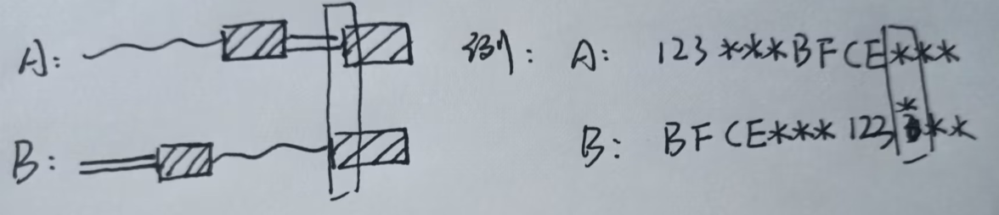

# 09双指针

[toc]

---

## 总体思想与技巧

-   双指针可以分为快慢指针和双向指针
    -   快慢指针多用于链表的操作(同向)(滑动窗口)
    -   双向指针多用于字符串的操作(相向)
    -   还有背向双指针

---

## leetCode141 判断链表成环

*   问题描述
    *   [问题地址](https://leetcode.cn/problems/linked-list-cycle/)

-   解题思路

    -   快慢指针
    -   快指针每次走两步
    -   慢指针每次走一步
    -   如果两个指针相遇则有换；如果快指针走到空，证明无环

-   实现代码

    -   ```python
        class Solution:
            def hasCycle(self, head: Optional[ListNode]) -> bool:
                if head == None or head.next == None:
                    return False
                fast = slow = head
                
                while fast != None:
                    fast = fast.next
                    if fast != None:
                        fast = fast.next
                    else:
                        return False
                    slow = slow.next
                    if slow == fast:
                        return True
        ```


---

## leetCode142 判断链表成环II

*   问题描述
    *   [问题地址](https://leetcode.cn/problems/linked-list-cycle-ii/)
    *   找出入环点

-   解题思路
    -   快慢指针；如果两个指针相遇；
    -   一个指针回到头节点；两个指针同步前进
    -   两个指针相遇的第一个节点就是入环节点

-   实现代码

    -   ```python
        class Solution:
            def detectCycle(self, head: Optional[ListNode]) -> Optional[ListNode]:
                if head == None or head.next == None:
                    return None
                fast = slow = head
                flag = False
                
                while fast != None:
                    fast = fast.next
                    if fast != None:
                        fast = fast.next
                    slow = slow.next
                    if slow == fast:
                        flag = True
                        break
                    
                if flag == False:
                    return None
                fast = head
                while fast != slow:
                    fast = fast.next
                    slow = slow.next
                return fast
        ```

---

## leetCode160 两链表相交

*   问题描述
    *   [问题地址](https://leetcode.cn/problems/intersection-of-two-linked-lists/)

-   解题思路_抖机灵

    -   两个指针从分别从两个链表头节点出发同步前进;
    -   如果其中一个指针到了None，则指向另一个链表的头，两指针继续同步前进
    -   直到两个指针相遇；相遇的节点即为相交的第一个点；如果两个值同时为None则说明两链表不相交
    -   

-   实现代码

    -   ```python
        class Solution:
            def getIntersectionNode(self, headA: ListNode, headB: ListNode) -> Optional[ListNode]:
                if headA == None or headB == None:
                    return None
                nodeA = headA
                nodeB = headB
                
                while nodeA != nodeB:
                    if nodeA != None:
                        nodeA = nodeA.next
                    else:
                        nodeA = headB
                    
                    if nodeB != None:
                        nodeB = nodeB.next
                    else:
                        nodeB = headA
                return nodeA
        ```

-   解题思路

    -   分别遍历两个链表；并记录两个链表的长度
    -   判断两个链表的尾节点是否相同；相同证明两个链表一定相交，反之不相交；`l: 18`
    -   如果相等，则两个指针都指回各自的head；较长的链表指针走 两链表长度之差步数；
    -   使两个指针同步向下；直到遇到的第一个相同节点就是第一个交点

-   实现代码

    -   ```python
        class Solution:
            def getIntersectionNode(self, headA: ListNode, headB: ListNode) -> Optional[ListNode]:
                if headA == None or headB == None:
                    return None
                nodeA = headA
                nodeB = headB
                
                lenA = 1
                while nodeA.next != None:
                    nodeA = nodeA.next
                    lenA += 1
        
                lenB = 1
                while nodeB.next != None:
                    nodeB = nodeB.next
                    lenB += 1
                
                if nodeA != nodeB:
                    return None
                if lenA > lenB:
                    nodeA = headA
                    for i in range(lenA - lenB):
                        nodeA = nodeA.next
                    nodeB = headB
                else:
                    nodeB = headB
                    for i in range(lenB - lenA):
                        nodeB = nodeB.next
                    nodeA = headA
                
                while nodeA != nodeB:
                    nodeA = nodeA.next
                    nodeB = nodeB.next
                return nodeA
        ```

---

## leetCode19 删除链表倒数第N节点

*   问题描述
    *   [问题地址](https://leetcode.cn/problems/remove-nth-node-from-end-of-list/)

-   解题思路

    -   快慢指针；让其中一个指针先走N步
    -   然后两个指针同步前进；当提前走的那个指针走到None, 此时另一个指针就是倒数第N个位置

-   实现代码

    -   ```python
        class Solution:
            def removeNthFromEnd(self, head: Optional[ListNode], n: int) -> Optional[ListNode]:
                if head.next == None:
                    head = None
                    return head
                # 以下情况均为大于等于二节点的情况
                end = head
                for i in range(n):
                    end = end.next
                
                cur = head
                while end != None:
                    pre = cur 
                    cur = cur.next
                    end = end.next
                if cur == head:
                    head = head.next
                else:
                    pre.next = cur.next
                return head
        ```


---

## leetCode21 merge两个链表

*   问题描述

    *   [问题地址](https://leetcode.cn/problems/merge-two-sorted-lists/)

*   解题思路

    *   节点采摘法

*   实现代码

    *   ```python
        class Solution:
            def mergeTwoLists(self, list1: Optional[ListNode], list2: Optional[ListNode]) -> Optional[ListNode]:
                if list1 == None:
                    return list2
                elif list2 == None:
                    return list1
                
                cur1 = list1
                cur2 = list2
        
                if cur1.val < cur2.val:
                    newHead = cur1
                    cur1 = cur1.next
                else:
                    newHead = cur2
                    cur2 = cur2.next
        
                curNew = newHead
                while cur1 and cur2:
                    if cur1.val < cur2.val:
                        curNew.next = cur1
                        cur1 = cur1.next
                    else:
                        curNew.next = cur2
                        cur2 = cur2.next
                    curNew = curNew.next
                
                curNew.next = cur1 if cur1 != None else cur2
                
                return newHead
        ```

---

## leetCode23 merge多个链表

*   问题描述

    *   [问题地址](https://leetcode.cn/problems/merge-k-sorted-lists/)

*   解题思路_1

    *   可以分别两两merge直到最后只剩一个链表；返回即可

*   实现代码

    *   ```python
        class Solution:
            def mergeKLists(self, lists: List[Optional[ListNode]]) -> Optional[ListNode]:
                def mergeTwoLists(list1, list2):
                    if list1 == None:
                        return list2
                    elif list2 == None:
                        return list1
                    
                    cur1 = list1
                    cur2 = list2
        
                    if cur1.val < cur2.val:
                        newHead = cur1
                        cur1 = cur1.next
                    else:
                        newHead = cur2
                        cur2 = cur2.next
        
                    curNew = newHead
                    while cur1 and cur2:
                        if cur1.val < cur2.val:
                            curNew.next = cur1
                            cur1 = cur1.next
                        else:
                            curNew.next = cur2
                            cur2 = cur2.next
                        curNew = curNew.next
                    
                    curNew.next = cur1 if cur1 != None else cur2
                    return newHead
        
                if len(lists) == 0:
                    return None
        
                while len(lists) != 1:
                    a = lists.pop()
                    b = lists.pop()
                    lists.append(mergeTwoLists(a, b))
                return lists[0]
        ```


-   解题思路_堆

    -   先将所有的节点值都放入一个小根堆中，再依次取出，最后连成链表并返回
    -   在最后生成链表的时候，小技巧是先定义一个零时表头，最后零时表头的next即为最终的链表`l:16-23`

-   实现代码

    -   ```python
        class Solution:
            def mergeKLists(self, lists: List[Optional[ListNode]]) -> Optional[ListNode]:
                if len(lists) == 0:
                    return None
        
                import heapq
                
                h = []
                for i in lists:
                    if i:
                        j = i
                        while j:
                            heapq.heappush(h, j.val)
                            j = j.next
                        
                res = ListNode()
                cur = res
                while len(h) != 0:
                        temp = ListNode(heapq.heappop(h))
                        cur.next = temp
                        cur = cur.next
        
                return res.next
        ```


---

## leetCode86 分隔链表

*   问题描述
    *   [问题地址](https://leetcode.cn/problems/partition-list/)

-   解题思路_1

    -   思路和荷兰国旗问题一样，准备一个指针遍历链表，另一个指针标记小于目标值的部分上界

    

-   解题思路_2

    -   准备两个零时表头，将小于target的串在一个链表中，大于等于的放另一个链表中，最后将两个链表串连

-   实现代码

    -   ```python
        class Solution:
            def partition(self, head: Optional[ListNode], x: int) -> Optional[ListNode]:
                if head == None:
                    return head
        
                big = ListNode()
                bigp = big
                small = ListNode()
                smallp = small
        
                cur = head
                while cur != None:
                    if cur.val < x:
                        smallp.next = cur
                        cur = cur.next
                        smallp = smallp.next
                        smallp.next = None
                    else:
                        bigp.next = cur
                        cur = cur.next
                        bigp = bigp.next
                        bigp.next = None
                
                smallp.next = big.next
        
                return small.next
        ```


---

## leetCode876 链表中点

*   问题描述
    *   [问题地址](https://leetcode.cn/problems/middle-of-the-linked-list/)

-   解题思路

    -   快慢指针，慢的走一步，快的走两步；当快指针走到空时，慢指针指到中点

-   实现代码

    -   ```python
        class Solution:
            def middleNode(self, head: Optional[ListNode]) -> Optional[ListNode]:
                if head.next == None:	
                    return head
                slow = fast = head
                while fast and fast.next != None:
                    fast = fast.next.next
                    slow = slow.next
                    
                return slow
        ```

---

## 滑动窗口思想与技巧

-   思路代码

    -   ```python
        need = collections.Counter(target)
        left = right = 0
        
        window = dict()
        # 存储当前窗口信息
        
        while right < len(s):
            # 窗口从右侧滑入一个字符
            temp = s[right]
            ...
            window[temp] = window.get(temp, 0 ) + 1
            # 收缩窗口
            while # 特定条件:
            	...
            	
                # 滑出窗口
                temp = s[left]
                window[temp] -= 1
                left += 1
            	...
            
            right += 1
        
        ```


---

## leetCode76 最小覆盖子串

*   问题描述
    *   [问题地址](https://leetcode.cn/problems/minimum-window-substring/)

-   解题思路
    -   维护一个从左往右的窗口；当发现一个可行解之后开始尝试收缩窗口，优化可行解直到最优解

-   实现代码

    -   ```python
        class Solution:
            def minWindow(self, s: str, t: str) -> str:
                if len(t) > len(s):
                    return ''
                import collections
        
                need = collections.Counter(t)
                needLen = len(t)
        
                start = end = None
                left = right = 0
                while right < len(s):
                    # 滑入窗口
                    temp = s[right]
                    if temp in t:
                        need[temp] -= 1
                        if need[temp] >= 0:
                            needLen -= 1
        
                    # 判断是否能收缩当前有效解窗口
                    while needLen == 0:
                        if start == None or end - start > right - left:
                            start = left
                            end = right
                        # 滑出
                        temp = s[left]
                        if temp in t:
                            need[temp] += 1
                            if need[temp] > 0:
                                needLen += 1
                        left += 1
                    right += 1
                
                if start == None:
                    return ''
                return s[start:end + 1]
        ```


---

## leetCode567 字符串的排列

*   问题描述
    *   [问题地址](https://leetcode.cn/problems/permutation-in-string/)

-   解题思路

    -   维护一个大小等于s1的窗口，在s2中遍历一次；判断是否存在一个窗口中包涵所有的字母

-   实现代码

    -   ```python
        class Solution:
            def checkInclusion(self, s1: str, s2: str) -> bool:
                import collections
                if len(s1) > len(s2):
                    return False
                left = 0
                right = left + len(s1) - 1
                # 窗口大小
                need = collections.Counter(s1)
        
                
        
                while right < len(s2):
                    if s2[left] in s1 and s2[right] in s1:
                        temp = collections.Counter(s2[left:right + 1])
                        if temp == need:
                            return True
                    left += 1
                    right += 1
                return False
        ```

---

## leetCode438 找到字符串中所有字母异位词

*   问题描述
    *   [问题地址](https://leetcode.cn/problems/find-all-anagrams-in-a-string/description/)

-   解题思路

    -   思路大致与上一题一致

-   实现代码

    -   ```python
        class Solution:
            def findAnagrams(self, s: str, p: str) -> List[int]:
                if len(p) > len(s):
                    return []
        
                import collections 
                need = collections.Counter(p)
                needLen = len(need)
                window = dict()
                res = []
                
                left = right = 0
                while right < len(s):
                    # 滑入
                    temp = s[right]
                    if temp in p:
                        window[temp] = window.get(temp, 0) + 1
                        if window[temp] == need[temp]:
                            needLen -=1
        			# punchline 
                    # 要分清楚收缩窗口的条件，使得每一次进行内层判断的窗口大小都是固定的
                    while right - left + 1 >= len(p):
                        if needLen == 0:
                            res.append(left)
                        
                        # 滑出
                        temp = s[left]
                        if temp in need:
                            if window[temp] == need[temp]:
                                needLen += 1
                            window[temp] -= 1
                        left += 1
                    right += 1
                return res
        ```


---

## leetCode3 无重复字符的最长子串

*   问题描述
    *   [问题地址](https://leetcode.cn/problems/longest-substring-without-repeating-characters/)

-   解题思路

    -   每次滑入一个字符，判断这个字符是否与前面的重复；
    -   如果不重复就判断并更新res，如果存在则缩小窗口直到窗口中再无重复字符，再进行下一次扩大窗口

-   实现代码

    -   ```python
        class Solution:
            def lengthOfLongestSubstring(self, s: str) -> int:
                if s == '':
                    return 0
                left = right = 0
                nowSet = set()
                res = -1
        
                while right < len(s):
                    # 滑入
                    temp = s[right]
                    if temp not in nowSet:
                        nowSet.add(temp)
                        res = res if res > len(nowSet) else len(nowSet)
                    # 收缩
                    else:
                        while s[left] != s[right]:
                            temp = s[left]
                            nowSet.remove(temp)
                            left += 1
                        left += 1
                    right += 1
                return res
        ```


---

## leetCode

*   问题描述
    *   [问题地址]()


