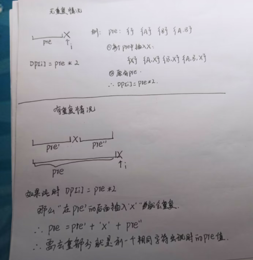

# Other

[toc]


---

## leetCode146 LRU 缓存

*   问题描述
    *   [问题地址](https://leetcode.cn/problems/lru-cache/description/)
*   解题思路
    *   双向链表 + 哈希表
    *   双向链表用于保存相对次序，双向链表在中间节点移除时时间复杂度是O(1)
    *   哈希表可以解决链表遍历O(n)复杂度的问题，可以降到O(1)
    *   插入一个节点
        *   判断该节点key是否已经存在；使用哈希表
            *   如果存在，那么就要更新原来的节点的相对位置，将它移动到链表的结尾
            *   如果不存在，那么追加到末尾，并登记在哈希表中
    *   查询一个节点
        *   判断是否存在该节点
            *   如果存在，返回对应值，并且要更新它的相对位置，将它移到末尾
            *   如果不存在，返回指定值

*   实现代码

    *   ```python
        class Node():
            def __init__(self, key, val):
                self.key = key
                self.val = val
                self.last = None
                self.next = None
        
        class doubleLink():
            def __init__(self):
                self.head = None
                self.tail = None
            
            def append(self, node):
                if self.head == None:
                    # 当前为空链表
                    self.head = node
                    self.tail = node
                else:
                    self.tail.next = node
                    node.last = self.tail
                    self.tail = node
        
            def remove(self, node):
                if self.head == self.tail:
                    # 删除唯一节点
                    self.head = None
                    self.next = None
                elif node.last == None:
                    # 删除头节点
                    self.head = node.next
                    node.next.last = None
                elif node.next == None:
                    # 删除尾节点
                    self.tail = node.last
                    node.last.next = None
                else:
                    # 普遍节点
                    node.next.last = node.last
                    node.last.next = node.next
        
        class LRUCache:
            def __init__(self, capacity: int):
                self.MAX = capacity
                self.len = 0
                self.Map = dict()
                self.link = doubleLink()
        
            def get(self, key: int) -> int:
                res = self.Map.get(key)
                if res == None:
                    return -1
                # 访问有效值要更新相对位置
                self.link.remove(res)
                # 移除后重新插入所以需要将节点重置，不能有之前的位置信息，这样才能正确追加到链表末尾
                res.last = None
                res.next = None
                self.link.append(res)
                return res.val
        
            def put(self, key: int, value: int) -> None:
                tempNode = Node(key, value)
                if self.Map.get(key) != None:
                    # key已经存在
                    self.link.remove(self.Map[key])
                    self.Map.pop(key)
                    self.len -= 1
                # 追加
                self.link.append(tempNode)
                self.Map[key] = tempNode
                self.len += 1
                if self.len > self.MAX:
                    # 长度超出
                    self.Map.pop(self.link.head.key)
                    self.link.remove(self.link.head)
                    self.len -= 1
        ```


---

## leetCode55 跳跃游戏

*   问题描述

    *   [问题地址](https://leetcode.cn/submissions/detail/392417914/)

*   解题思路

    1.   可以使用动规思路解；但是时间复杂度是O(n^2) 空间复杂度是O(n)

    2.   
         *   维护一个当前步数能到达的最大范围curMax，并维护一个下一个步数能到达地的最大范围nextMax
         *   从当前范围到下一层范围的条件就是步数+1(如果题目需要统计步数)
         *   如果当前指针在当前的最大窗口内那么可以尝试用当前位置的值更新nextMax
         *   前提是如果通过当前值再跳一步的范围大于nextMax
         *   如果当前指针不在当前最大的窗口范围内，那么就跨一步，并且进入下一层范围；
         *   再次判断当前范围内的值能否拓宽nextMax；遇到0则要判断nextMax是否最大只能达到当前0位置；
         *   如果是，则证明无法跳跃到终点(如果是最后一个位置的0则能到达终点)，不是则继续执行尝试更新nextMax和移动当前指针的操作

*   实现代码

    *   ```python
        class Solution:
            def canJump(self, nums: List[int]) -> bool:
                if len(nums) == 1:
                    return True
                # step = 0
                curMax = 0
                nextMax = None
        
                for i in range(len(nums) - 1):
                    # 这里不需要走到最后一个位置；因为倒数第二个位置如果合法那么就一定能抵达最后，所以只需要判断到倒数第二即可;
                    if curMax < i:
                        # step += 1
                        # 因为从当前最大范围进入下一层最大范围的条件就是步数+1
                        curMax = nextMax
                    nextMax = nums[i] + i if nextMax == None or nextMax < nums[i] + i else nextMax
                    if nums[i] == 0 and nextMax == i:
                        return False
                return True
        ```


---

## leetCode149 直线上最多的点数:star:

*   问题描述

    *   [问题地址](https://leetcode.cn/problems/max-points-on-a-line/description/)

*   解题思路

    *   只能穷举没过每一个点的每一条直线
    *   统计过每一个点每一种斜率的点个数，再求过当前点覆盖点最多的个数，最后返回所有点中最大的
    *   斜率为正无穷时需要单独统计`l:30`，还需要考虑重合点的情况`l:29`；
    *   细节
        -   线上的点其实时组合关系，如果在处理a点时处理过ab这条线，那么就没有必要处理ba这条线
        -   在求斜率存入字典时，需要注意，因为程序中除法存在精度丢失的情况，**如果直接(y1-y2)/(x1-x2)然后作为斜率统计那么可能出现两个斜率并不相同的点被统计到一个斜率上**1,00000000000000001就会和斜率为1的点被统计到一条直线上；为了避免应该选择用分数的形式约分后统计
        -   约分就涉及到求最大公约数，可以用辗转相除求
        -   **在字典中找出最大的val值**`l:45`

*   实现代码

    *   ```python
        class Solution:
            def maxPoints(self, points: List[List[int]]) -> int:
                resList = []
                
                def func(x, y):
                    # 求两个数的最大公约数
                    if x == 0:
                        return '0'
                    if abs(x) < abs(y):
                        a = abs(x)
                        b = abs(y)
                    else:
                        a = abs(y)
                        b = abs(x)
                    
                    # 辗转相除
                    res = b % a
                    while res != 0:
                        b = a
                        a = res
                        res = b % a
        
                    # 同号
                    if x > 0 and y > 0 or x < 0 and y < 0:
                        return str(abs(x) // a) +'_' + str(abs(y) // a)
                   	# 异号
                    else:
                        return '-' + str(abs(x) // a) +'_' + str(abs(y) // a)
                    # 以'a_b'的形式返回作为字典的key
        
                for i in range(len(points)):
                    same = 0
                    sameX = 0
                    other = dict()
                    for j in range(i, len(points)):
                        if points[j][0] == points[i][0] and points[j][1] == points[i][1]:
                            # 同一点
                            same += 1
                        elif points[j][0] == points[i][0]:
                            sameX += 1
                        else:
                            temp = func(points[i][1] - points[j][1], points[i][0] - points[j][0])
                            other[temp] = other.get(temp, 0) + 1
                    if len(other) != 0:
                        res = other[max(other, key = lambda x : other[x])]
                    else:
                        res = 0
                    res = max(res, sameX) + same
                    resList.append(res)
                return max(resList)
                # return resList
        ```


---

## leetCode剑指 Offer 49. 丑数

*   问题描述
    *   [问题地址](https://leetcode.cn/problems/chou-shu-lcof/)	

-   解题思路

    -   因为最小的丑数规定为1，且往后的丑数都是较小的丑数成2、3、5得到的；所以可以从1推到第n个丑数
    -   定义三个指针，分别代表下一个丑数×2 下一个整数×3 下一个数×5
    -   每一轮都选择当前三个指针中最小的值(可能出现多个指针所指的值相同)，将最小的那个数的指针移动到下一个丑数上

-   实现代码

    -   ```python
        class Solution:
            def nthUglyNumber(self, n: int) -> int:
                res = [1]
                n -= 1
        
                p2 = 0
                p3 = 0
                p5 = 0
        
                for i in range(n):
                    temp = min(res[p2] * 2, res[p3] * 3, res[p5] * 5)
                    if res[p2] * 2 == temp:
                        p2 += 1
                    if res[p3] * 3 == temp:
                        p3 += 1
                    if res[p5] * 5 == temp:
                        p5 += 1
                    res.append(temp)
                
                return res[-1]
        ```

---

## 最小不可组成和

-   问题描述

    -   给定一个**正整数**数组arr，该数组所有子数组的和最小记作left，最大记作right，则在区间[left, right]上第一个正整数数组无法组成的数即为最小不可组成和，如果都能组合出，那么最小不可组成和就是right+1，将其返回

-   解题思路

    -   因为所有的数组元素都为正整数，所以最小子集和就是数组最小值min(arr), 最大子集和就是sum(arr)
    -   如此以来，问题就可以抽象成一个01背包问题；分别推算出在所有元素中能否组成[0, right]；最后遍历`DP[-1][left ~ right]`第一个出现False的下标值就是最小不可组成和；如果遍历结束都没遇到False则返回right+1

-   实现代码

    -   ```python
        # arr = [1, 2, 4]
        arr = [1, 11, 3]
        def DPfunc():
            left = min(arr)
            right = sum(arr)
        
            DP = [[False for j in range(right + 1)] for i in range(len(arr))]
            DP[0][0] = DP[0][arr[0]] = True
        
            for i in range(1, len(arr)):
                DP[i][0] = True
                for j in range(1, right + 1):
                    DP[i][j] = DP[i - 1][j] or (DP[i - 1][j - arr[i]] if j - arr[i] >= 0 else False)
            for j in range(left + 1, right + 1):
                if DP[-1][j] == False:
                    return j
            
            return right + 1
        ```

-   进阶问题

    -   如果现在能肯定数组中有1这个元素，请问能否实现比DP更快的算法输出最小不可组成和

-   解题思路

    -   先将数组升序排序
    -   定义一个范围area`l:3`, 初值赋为1；数组指针从1开始，范围变量表示当前指针之前的元素能拼出[1, area]
    -   如果当前指针所指元素 <= area`l:6`;说明当前所指元素在[1, area]，且当前位置之前能凑出[1, area]所有元素，那么加上当前元素area就能连续凑出[1, area + arr[i]] 更新area；如果一个当前值 > area + 1 [area, arr[i] - 1] 之前的数拼凑不出来，返回area+1
    -   例如如果当前值为9 而area为8  ； 9 <= area + 1 如果9加入，单独选9不需要area帮助能**将area这个连续的范围**扩充到9，如果选9让area帮忙解决1即可扩充到10；(因为area连续而且当前值合法的前提下是area中或者在area上届+1的位置)那么area在和当前值配合的情况下可以将范围扩充到[area+1, area+arr[i]]；如果当前值>area  + 1 证明area + 1 到当前值都之间的值都不可组成，返回area+1(因为当前位置及其往后的数都一定> area + 1，固然不可能再平凑出area + 1)
    -   "为什么要求数组中一定要有1?" 因为要保证area从一开始就是连续的，假设arr中最小的是3那么area就无法[1, 2]在这个区间上拼凑出来，排序也是必须的一步

-   实现代码

    -   ```python
        def rangeFunc(arr):
            arr.sort()
            area = 1
        
            for i in arr[1:]:
                if i <= area + 1:
                    # 合法
                    area += i
                else:
                    return area + 1
            return area + 1 
        ```


---

## leetCode08.14. 布尔运算

*   问题描述

    *   [问题地址](https://leetcode.cn/problems/boolean-evaluation-lcci/)

*   解题思路

    *   如果按每个运算符为最后结合分类；那么将可以不重不漏地统计所有有效方法；按该运算符分成左右两个部分再进行递归即可；
    *   递归的base case及是传入的表达式只有'0'或'1'两个字符时，此时如果字符为所需要的表达式值则返回1表示为一种有效方法；反之为0
    *   递归时要根据当前运算符选择下层递归时左右两边的所有合法情况和所需表达式值
    *   当得到两边所有合法方式数时将他们相乘，即可得到当前位置最后结合的所有不同合法情况
    *   如此这般，依次统计每个运算符 最后结合的情况
    *   优化：记忆化搜索

*   实现代码

    *   ```python
        class Solution:
            def countEval(self, s: str, result: int) -> int:
                res = 0
                memo = dict()
        
                def func(s, r):
                    # 记忆化搜索
                    if memo.get(s + str(r)) != None:
                        return memo[s + str(r)]
                    if len(s) == 1:
                        if int(s) == r:
                            return 1
                        else:
                            return 0
                    
                    count = 0
                    for i in range(1, len(s), 2):
                        # 每一次都一定指向逻辑运算符
                        cur = s[i]
                        # punchline
                        l0 = func(s[:i], 0)
                        l1 = func(s[:i], 1)
                        r0 = func(s[i + 1:], 0)
                        r1 = func(s[i + 1:], 1)
                        if cur == '|':
                            # 在分类时必须分清每一种运算符每一种运算结果的可能性；左右两边各有True和False两种情况；所以为4种不同情况
                            if r == 1:
                                count += l1 * r0 + l0 * r1 + l1 * r1
                            else:
                                count += l0 * r0
                        elif cur == '&':
                            if r == 1:
                                count += l1 * r1
                            else:
                                count += l1 * r0 + l0 * r0 + l0 * r1
                        else:
                            # ^ 不同为1 相同为0
                            if r == 1:
                                count += l1 * r0 + l0 * r1
                            else:
                                count += l1 * r1 + l0 * r0
        
                    # 记忆化搜索
                    memo[s + str(r)] = count
                    return memo[s + str(r)]
                
                res = func(s, result)
        
                return res
        ```


---

## leetCode517 超级洗衣机

*   问题描述
    *   [问题地址](https://leetcode.cn/problems/super-washing-machines/description/)

*   解题思路

    *   总体思路和最长自增子序列类题大体相同——求出每个位置的瓶颈或最优解，最终在综合每个位置求出最终解
    *   此题中，如果计算得到每个位置需要运行的轮次，那么最终的答案就是所有位置中的最大值
    *   如果最终能平分，那么每个位置上的最终值都是一样的，且可以轻松计算得到`l:12`
    *   一个位置的左侧和，右侧和也可以轻松得到；如果当前位置的左右两侧所需都为负数，证明当前位置要分别像左右两侧运送衣服；
    *   那么当前位置的值就是两边所需件数和的绝对值`l:21`；因为要向两侧运送衣服只能一件一件地运，运送一个位置一轮中只能向一个方向送衣服
    *   否则，当前位置的运行轮次就是两侧值的绝对值中的较大者`l:23`

*   实现代码

    *   ```python
        class Solution:
            def findMinMoves(self, machines: List[int]) -> int:
                LEN = len(machines)
                SUM = sum(machines)
                if LEN == 1:
                    return 0
                if SUM % LEN != 0:
                    # 不可能被平分
                    return -1
                
        
                target =  SUM // LEN
                
                res = -1
                lSum = 0
        
                for i in range(LEN):
                    lNeed = lSum - i * target
                    rNeed = (SUM - lSum - machines[i]) - (target * (LEN - i - 1))
                    if lNeed < 0 and rNeed < 0:
                        temp = abs(lNeed + rNeed)
                    else:
                        temp = max(abs(lNeed), abs(rNeed))
                    lSum += machines[i]
                    res = max(res, temp)
                
                return res
        ```


---

## step sum

*   问题描述

    *   step sum定义：一个数的步骤和 为该数字依次抹去最右侧数字的数值之和
    *   例如 132： 132 + 13 + 1 = 146 那么146就是132的步骤和
    *   给定一个数字n，如果是某个数字m的步骤和则返回m，如果不是则返回 -1

*   解题思路

    *   单调性 就要 联想到二分
    *   如果A > B，A的步骤和为a，B的步骤和为b那么 一定有a > b
    *   所以该题可以用二分

*   实现代码

    *   ```python
        num = 269
        
        left = 0
        right = num
        
        def getStepSum(n):
            res = 0
            while n:
                res += n
                n //= 10
            return res
        
        while left <= right:
            mid = (left + right) // 2
            temp = getStepSum(mid)
            if temp == num:
                break
            elif temp < num:
                left = mid + 1
            else:
                right = mid - 1
        
        if left > right:
            print(-1)
        else:
            print(mid)
        ```


---

## leetCode378 有序矩阵中第 K 小的元素

*   问题描述

    *   [问题地址](https://leetcode.cn/problems/kth-smallest-element-in-a-sorted-matrix/description/)

*   解题思路_堆

    *   解题思路和merge多个有序链表思路相同，依次将节点加入堆中，弹出一个节点时如果它有后续节点则将节点加入堆
    *   弹出k次 所得到的数字就是第k小值
    *   该题难点就是在于堆的使用

*   实现代码

    *   ```python
        class Solution:
            def kthSmallest(self, matrix: List[List[int]], k: int) -> int:
                LEN = len(matrix)
                temp = [(matrix[i][0],i , 0) for i in range(len(matrix))]
                heapq.heapify(temp)
        
                for i in range(k):
                    res, x, y = heapq.heappop(temp)
                    if y <= LEN - 2:
                        heapq.heappush(temp, (matrix[x][y + 1], x, y + 1))
                return res
        ```

*   解题思路_继续单调性的二分

    *   略

*   实现代码

    *   ```python
        class Solution:
            def kthSmallest(self, matrix: List[List[int]], k: int) -> int:
                Len = len(matrix)
        
                def getInfo(target):
                    # 返回小于等于target的数字的个数，并返回向下最接近target的值
                    n = 0
                    num = None
        
                    y = Len - 1
                    x = 0
                    while x <= Len - 1 and y >= 0:
                        if matrix[x][y] <= target:
                            n += (y + 1)
                            num = matrix[x][y] if num == None or num < matrix[x][y] else num
                            x += 1
                        else:
                            y -= 1
                    return n, num
                
                left = matrix[0][0]
                right = matrix[-1][-1]
                while left <= right:
                    mid = left + ((right - left) >> 1)
                    n, num = getInfo(mid)
        
                    if n == k:
                        res = num
                        break
                    elif n < k:
                        left = mid + 1
                    else:
                        res = num
                        right = mid - 1
                return res
        ```


---

## leetCode940 不同的子序列 II

*   问题描述

    *   [问题地址](https://leetcode.cn/problems/distinct-subsequences-ii/)

*   解题思路

    *   假设字符串中没有重复字符；假设从左向右依次扫描，扫描到i位置时，[0,i - 1]的子序列个数为pre，那么加入当前字符后，子序列个数就是pre * 2
    *   因为在每一个pre的基础上加入一个当前字符，再加上原本的pre都是不重不漏的
    *   假如存在重复字符；如果再按之前的方式处理，就会出现重复的现象
    *   
    *   coding技巧：可以一开始包含空集，在最后输出步骤将答案 - 1 即可，这样可以方便每次插入数时递推公式的统一

*   实现代码

    *   ```python
        class Solution:
            def distinctSubseqII(self, s: str) -> int:
                
                memo = dict()
                # 计算时先包含空集，最后输出-1即可，因为这样方便递推
                cur = 1
                pre = cur
                for i in range(len(s)):
                    if memo.get(s[i]) == None:
                        # 每一个字符上一次出现位置时的值
                        cur = pre * 2
                    else:
                        cur = pre * 2 - memo[s[i]]
                    memo[s[i]] = pre
                    pre = cur
                
                return (cur - 1) % (10**9 + 7)
        ```


---

## leetCode632 最小区间

*   问题描述
    *   [问题地址](https://leetcode.cn/problems/smallest-range-covering-elements-from-k-lists/description/)

*   解题思路

    *   利用一行的单调性特点 + 小根堆
    *   先将每一行的首元素加入堆中去，同时带上每个元素的行列信息
    *   现在堆中的最小值和最大值组成的区间一定符合每一行中至少一个元素在其中的要求，在此基础上不断地优化和缩小即可
    *   注意小根堆只能保证第一个元素最小，不能保证最大元素所处位置，所以在加入元素时记录
    *   依次弹出元素，判断当前元素值和当前堆中的最大值是否比之前的结果更加优，尝试更新
    *   在每次加入一个元素时判断它是否比当前堆中的最大值大，每次加入元素判断它和当时最大值，这样就能结合堆的特性不停得到最大值和最小值
    *   再加入当前处理元素的后一个元素到堆中去，如果没有后续元素就退出并返回当前答案

*   实现代码

    *   ```python
        class Solution:
            def smallestRange(self, nums: List[List[int]]) -> List[int]:
                heap = []
                resLeft = resRight = None
                right = None
        
                for i in range(len(nums)):
                    right = nums[i][0] if right == None or right < nums[i][0] else right
                    heapq.heappush(heap, (nums[i][0], i, 0))
                
                resLeft = heap[0][0]
                resRight = right
                while True:
                    left, x, y = heapq.heappop(heap)
        
                    # 尝试更新答案
                    if right - left < resRight - resLeft:
                        resLeft, resRight = left, right
                        if right - left == 0:	# 优化	
                            return [resLeft, resRight]
                    
                    if y + 1 < len(nums[x]):
                        # 当前点 还有后续
                        heapq.heappush(heap, (nums[x][y + 1], x, y + 1))
                        if nums[x][y + 1] > right:
                            right = nums[x][y + 1]
                    else:
                        break     
                return [resLeft, resRight]
        ```


---

## leetCode169 多数元素(水王数)

*   问题描述
    *   [问题地址](https://leetcode.cn/problems/majority-element/description/)

*   解题思路

    *   同时删除两个不同的元素，最终剩余的就**有可能为水王数**，再遍历数组一遍进行个数统计在计算便可以验证
    *   实现同时删除两个不同的元素，指针从左往右扫描，定义一个遍历target，一个计数变量tNum表示target值出现的次数
    *   如果当前target为空则将当前值赋给target，如果当前值不等于target那么tNum -= 1，如果tNum归0了证明targe消耗完了，置空
    *   如果当前值等于target那么就tNum += 1

*   实现代码

    *   ```python
        class Solution:
            def majorityElement(self, nums: List[int]) -> int:
                N = len(nums)
        
                target = None
                tNum = 0
        
                for i in range(N):
                    if target == None:
                        target = nums[i]
                        tNum = 1
                    elif target != nums[i]:
                        tNum -= 1
                        if tNum == 0:
                            target = None
                    else:
                        tNum += 1
        		
                
                # 如果没有数字存活，说明不存在这个数
                # 此题中是一定存在水王数的，需要验证存活的数字是否有效
                # if target == None:
                #     return None
                # count = 0
                # for i in range(N):
                #     if nums[i] == target:
                #         count += 1
                
                # return True if count / N > 0.5 else False
        
                return target
        ```


---

## leetCode229 多数元素II

*   问题描述

    *   [问题地址](https://leetcode.cn/problems/majority-element-ii/)

*   解题思路

    *   如果要求出现初次超过n/k，k是指定整数，k为2时就是 水王数问题，k不为2时其解题思路大致与k为2相同
    *   符合条件的数最多为k - 1个
    *   k个数为一组删除；

*   实现代码

    *   ```python
        class Solution:
            def majorityElement(self, nums: List[int]) -> List[int]:
                k = 3
                N = len(nums)
                # 
                target = dict()
        
                for i in range(N):
                    # 如果当前字符在target中:
                    if target.get(nums[i]) != None:
                        target[nums[i]] += 1
                    else:
                        if len(target) == k - 1:
                            # 满了加不了了，那么表中所有元素-1
                            temp = []
                            for j in target:
                                target[j] -= 1
                                if target[j] == 0:
                                    temp.append(j)
                            for j in temp:
                                target.pop(j)
                        else:
                            target[nums[i]] = 1
                for j in target:
                    target[j] = 0
                
                for i in range(N):
                    if target.get(nums[i]) != None:
                        target[nums[i]] += 1
                
                res = []
                for j in target:
                    if target[j] > N / k:
                        res.append(j)
                
                return res
        ```


---

## leetCode402 移掉 K 位数字

*   问题描述

    *   [问题地址](https://leetcode.cn/problems/remove-k-digits/)

*   解题思路

    *   一个数值如果想尽量大，那么对应位置上就存在单调性
    *   利用单调栈的特点，确保一个数字一定比之前的数字都小(前提是删除名额还有剩)
    *   每个数字依次入栈，在入栈之前删除所有比它大的字符(前提是删除名额还有剩)
    *   从左往右入栈，所以是优先删除左侧较小的数，这样比删除右侧较小的数让一个数变小的趋势跟快

*   实现代码

    *   ```python
        class Solution:
            def removeKdigits(self, num: str, k: int) -> str:
                N = len(num)
                remain = N - k
                delNum = k
                if remain <= 0:
                    return '0'
                
                stack = []
                for c in num:
                    while stack and delNum > 0 and stack[-1] > c:
                        stack.pop()
                        delNum -= 1
                    stack.append(c)
                res = ''.join(stack[:remain]).lstrip('0')
                return res if res != '' else '0'
        ```


---

## leetCode316. 去除重复字母

*   问题描述
    *   [问题地址](https://leetcode.cn/problems/remove-duplicate-letters/)

*   解题思路

    *   统计每个字符出现的次数；如果其实位置定位-1，那么统计出的字典也可以理解为，当前位置往后字符出现的次数
    *   利用单调栈的特点，依次从左往右入栈每个字符，如果当前字符已经在栈中了则直接将当前字符在字典中-1，如果不在，那么久要找到它应该在的位置
    *   通过删除前面的数字使得追加当前字符后字典序变小，删除当前字符之前的比当前字符大的字符
    *   删除的前提：删除字符在当前位置往后必须还有

*   实现代码

    *   ```python
        class Solution:
            def removeDuplicateLetters(self, s: str) -> str:
                import collections
                memo = collections.Counter(s)
                resLen = len(memo)
        
                stack = []
                for c in s:
                    if c not in stack:
                        # 找到合适位置
                        while stack and stack[-1] > c and memo[stack[-1]] > 0:
                            stack.pop()
                        stack.append(c)
                    memo[c] -= 1
                return ''.join(stack)
        ```


---

## leetCode321 拼接最大数

*   问题描述
    *   [问题地址](https://leetcode.cn/problems/create-maximum-number/)

*   解题思路

    *   因为不确定从每个数中分别取多少个元素，所以只能穷举两个数组取值的可能；
    *   实现从一个数组中去长度为k的子序列，要求字面值要最大；方法和移除k个数的题目的方法相似
    *   分别求两个数组中取不同长度最大的子序列；每次得到之后都要将两个所得数组合并
    *   合并时注意不能单纯采用节点采摘的方法，因为每个数组中都是无序的，要保持的是相对次序

*   实现代码

    *   ```python
        class Solution:
            def maxNumber(self, nums1: List[int], nums2: List[int], k: int) -> List[int]:
        
                def func(nums, k):
                    if k == 0:
                        return []
                    if len(nums) < k:
                        return -1
        
                    delNum = len(nums) - k
                    # 在nums中子序列长度为k的情况下，值最大返回
                    stack = []
                    for n in nums:
                        while stack and delNum > 0 and stack[-1] < n:
                            stack.pop()
                            delNum -= 1
                        stack.append(n)
                    return stack[:k]
        
                # puchline
                def merge(r1, r2):
                    p1 = p2 = 0
                    res = []
                    while p1 < len(r1) and p2 < len(r2):
                        if r1[p1:] > r2[p2:]:
                            res.append(r1[p1])
                            p1 += 1
                        else:
                            res.append(r2[p2])
                            p2 += 1
                    if p1 == len(r1):
                        res += r2[p2:]
                    else:
                        res += r1[p1:]
                    return res
                    
                res = [-1]
                for i in range(k + 1):
                    r1 = func(nums1, i)
                    if r1 == -1:
                        continue
                    r2 = func(nums2, k - i)
                    if r2 == -1:
                        continue
                    temp = merge(r1, r2)
                    res = res if res > temp else temp
                return res
            
        ```


---

## leetCode2 两数相加

*   问题描述
    *   [问题地址](https://leetcode.cn/problems/add-two-numbers/description/)

*   解题思路

    *   和做加法一样，定义一个r初值赋值为0，r表示之前位的进位信息；
    *   创建一个新链表时可以多创建出一个正常节点，最后返回这个节点的next就是一条完整的链表
    *   如果一个链表节点耗尽了，那么领一个链表的节点在相加时只需要考虑自己和r相加就可以了
    *   在两个链表都耗尽时判断r时候为1

*   实现代码

    *   ```python
        # Definition for singly-linked list.
        # class ListNode:
        #     def __init__(self, val=0, next=None):
        #         self.val = val
        #         self.next = next
        class Solution:
            def addTwoNumbers(self, l1: Optional[ListNode], l2: Optional[ListNode]) -> Optional[ListNode]:
                
                # punchline
                head = resList = ListNode()
                p1 = l1
                p2 = l2
                
                r = 0
                while p1 or p2:
                    temp = r
                    if p1 != None:
                        temp += p1.val
                        p1 = p1.next
                    if p2 != None:
                        temp += p2.val
                        p2 = p2.next
                    
                    resList.next = ListNode(temp % 10)
                    resList = resList.next
                    r = temp // 10
        
                if r == 1:
                    resList.next = ListNode(r).
                    
                # punchline
                return head.next
        ```


---

## leetCode517 超级洗衣机

*   问题描述

    *   [问题地址](https://leetcode.cn/problems/super-washing-machines/description/)

*   解题思路

    *   所给数据可以计算得到每个位置最终应该得到的衣物数量，且可以过滤`l:3-9`；
    *   每个位置左右两边的衣服总和信息，都能计算得到当前位置使回合数增加到何种程度；
    *   每个位置都计算一个位置，最终求个最大值就是最终结果
    *   如果左右两边都是负数，说明当前位置需要像左右两边分别发所需数量的衣服，因为一台机器同时只能向一个方向发一件衣服，所以为`l:20`
    *   其他情况都是左右两边中绝对值较大的那个
    *   再求左右两边衣服数量时可以维护一个左侧和lSum，右侧和可以通过计算得到

*   实现代码

    *   ```python
        class Solution:
            def findMinMoves(self, machines: List[int]) -> int:
                LEN = len(machines)
                SUM = sum(machines)
                if LEN == 1:
                    return 0
                if SUM % LEN != 0:
                    # 不可能被平分
                    return -1
        
                target =  SUM // LEN
                
                res = -1
                lSum = 0
        
                for i in range(LEN):
                    lNeed = lSum - i * target
                    rNeed = (SUM - lSum - machines[i]) - (target * (LEN - i - 1))
                    if lNeed < 0 and rNeed < 0:
                        temp = abs(lNeed + rNeed)
                    else:
                        temp = max(abs(lNeed), abs(rNeed))
                    lSum += machines[i]
                    res = max(res, temp)
                
                return res
        ```


---

## leetCode13 罗马数字转整数

*   问题描述

    *   [问题地址](https://leetcode.cn/problems/roman-to-integer/)

*   解题思路

    *   罗马数字中不存在位权，所以每个字符都代表一个完整的数，最终将每个数对应值累加即可
    *   注意当4、9、40、90这些值时是两个字符表示一个值，所以判断当前字符是否是和后面一个字符共同结合表示一个值
    *   结合哈希表

*   实现代码

    *   ```python
        class Solution:
            def romanToInt(self, s: str) -> int:
                meme1 = {
                    'I': 1,
                    'V': 5,
                    'X': 10,
                    'L': 50,
                    'C': 100,
                    'D': 500,
                    'M': 1000
                }
                memo2 = {
                    'IV': 4,
                    'IX': 9,
                    'XL': 40,
                    'XC': 90,
                    'CD': 400,
                    'CM': 900
                }
                sum = 0
                i = 0
                while i < len(s):
                    if memo2.get(s[i:i + 2]):
                        sum += memo2[s[i:i + 2]]
                        i += 1
                    else:
                        sum += meme1[s[i]]
                    i += 1
                return sum
        ```


---

## leetCode12 整数转罗马数字

*   问题描述

    *   [问题地址](https://leetcode.cn/problems/integer-to-roman/description/)

*   解题思路_低端版本

    *   因为阿拉伯数字中是又数字和位权共同表示一个位置上的信息的，所以我们依次取出每个位置上的数字，转换为对应值即可

*   实现代码

    *   ```python
        class Solution:
            def intToRoman(self, num: int) -> str:
                res = ''
                memo1 = {1: 'I', 2:'II', 3:'III', 4:'IV', 5:'V', 6:'VI', 7:'VII', 8:'VIII', 9:'IX', 0: ''}
                memo10 = {1: 'X', 2:'XX', 3:'XXX', 4:'XL', 5:'L', 6:'LX', 7:'LXX', 8:'LXXX', 9:'XC', 0: ''}
                memo100 = {1: 'C', 2:'CC', 3:'CCC', 4:'CD', 5:'D', 6:'DC', 7:'DCC', 8:'DCCC', 9:'CM', 0: ''}
                memo1000 = {1: 'M', 2:'MM', 3:'MMM', 0: ''}
        
                res += memo1000[num // 1000]
                num %= 1000
                res += memo100[num // 100]
                num %= 100
                res += memo10[num // 10]
                num %= 10
                res += memo1[num]
        
                return res
        ```

*   解题思路_高端版本

    *   大体思路与上面的代码一样，不同的是这种方法巧妙地运用了整除和取余的特性，将特殊的需要两个字符表示的值枚举清楚，其他的重复的都可以通过整除的商`l:8-9`复制
    *   哈希表内的顺序必须是从打到小

*   实现代码

    *   ```python
        class Solution:
            def intToRoman(self, num: int) -> str:
                res = ''
                
                memo = {1000:'M', 900:'CM', 500:'D', 400:'CD', 100:'C', 90:'XC', 50:'L', 40:'XL', 10:'X', 9:'IX', 5:'V', 4:'IV', 1:'I'}
                
                for q in memo:
                    times = num // q
                    res += memo[q] * times
                    num %= q
               
                return res
        ```


---

### leetCode14 最长公共前缀

*   问题描述
    *   [问题地址](https://leetcode.cn/problems/longest-common-prefix/)

*   解题思路_指针

    *   用一个指针i从0开始，依次判断每个位置上的i是否相同，如果不同或者其中一个字符串已经到了结尾就退出并返回`l:9 12`

*   实现代码

    *   ```python
        class Solution:
            def longestCommonPrefix(self, strs: List[str]) -> str:
                if len(strs) == 1:
                    return strs[0]
        
                i = 0
                while True:
                    for j in range(1, len(strs)):
                        if i == len(strs[j]) or i == len(strs[j - 1]) or strs[j][i] != strs[j - 1][i]:
                            return strs[0][:i]
                    i += 1
                return strs[0][:i]
        ```

*   解题思路_两两比较

    *   假设需要求的是`s1、s2、s3、s4....sn`的最长公共前缀，s1和s2的最长公共前缀为r1，那么问题就等价于`r1、s3、s4....sn`的最长公共前缀

*   实现代码

    *   ```python
        class Solution:
            def longestCommonPrefix(self, strs: List[str]) -> str:
                if len(strs) == 1:
                    return strs[0]
        
                def commandPrefix(s1, s2):
                    i = 0
                    while i < len(s1) and i < len(s2) and s1[i] == s2[i]:
                        i += 1
                    
                    return s1[:i]
                
                pre = strs[0]
                for i in range(1, len(strs)):
                    pre = commandPrefix(pre, strs[i])
                return pre
        ```


---

## leetCode

*   问题描述
    *   [问题地址]()

